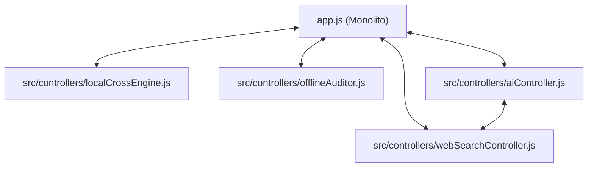

# Relatório de Auditoria de Arquitetura e Segurança de Segredos

> **Data da Auditoria:** 11/08/2026  
> **Escopo:** Mapeamento de camadas (Apresentação, Negócio, Acesso a Dados), acoplamento de módulos, dependências circulares e varredura de credenciais/segredos no histórico Git.  
> **Status de Alteração:** *Apenas reporte (nenhum arquivo foi modificado).*

---

## 1. Mapeamento da Estrutura de Pastas e Separação de Camadas

### 1.1 Visão Geral da Topologia
```text
edital-audit/
├── .gitignore                      # Regras de exclusão Git (Ausente: .env)
├── requirements.txt                # Dependências Python
├── index.html                      # Ponto de entrada SPA (Frontend)
├── styles.css                      # Estilização global e temas cyber
├── app.js                          # Monolito Frontend (8.196 linhas)
├── sample_data.js                  # Mocks e dados estáticos de demonstração
├── server.py                       # Monolito Backend (2.512 linhas)
├── launcher.py                     # Launcher Desktop / Tray Icon
├── src/
│   ├── xlsx.full.min.js            # Biblioteca externa para manipulação de planilhas
│   └── controllers/
│       ├── aiController.js         # Orquestrador de IA / SSE Handoff
│       ├── auditorDB.js            # Wrapper IndexedDB (Persistência local)
│       ├── contextExtractor.js     # Taxonomia e extração contextual
│       ├── localCrossEngine.js     # Motor de cruzamento de regras offline
│       ├── offlineAuditor.js       # Simulador e gerador de relatórios offline
│       ├── stateIntegrityManager.js# Sanitização e reparo de estado
│       └── webSearchController.js  # Integração de busca web
├── services/
│   ├── api.py                      # Cliente de provedores LLM + SemanticCache
│   └── skills/
│       └── anki_exporter.py        # Exportador de flashcards Anki
└── [22 scripts soltos na raiz]    # Testes unitários (14) e utilitários de download/busca (8)
```

### 1.2 Diagnóstico de Acoplamento e Violação de Camadas

> [!WARNING]
> **Anti-Padrão Detectado: *God Files* / Monolitos Multicamada**  
> Tanto o backend ([`server.py`](file:///c:/Users/victo/.gemini/antigravity-ide/scratch/edital-audit/server.py)) quanto o frontend ([`app.js`](file:///c:/Users/victo/.gemini/antigravity-ide/scratch/edital-audit/app.js)) concentram Apresentação, Lógica de Negócio e Acesso a Dados em arquivos únicos com milhares de linhas.

#### A. Backend ([`server.py`](file:///c:/Users/victo/.gemini/antigravity-ide/scratch/edital-audit/server.py) — 2.512 linhas)
| Camada | Responsabilidades Presentes no Arquivo | Trechos Críticos |
| :--- | :--- | :--- |
| **Apresentação / Roteamento** | Servidor HTTP `BaseHTTPRequestHandler`, headers CORS, parsing de query strings, endpoints SSE `/api/audit-stream`, serialização JSON. | [`server.py:656-1050`](file:///c:/Users/victo/.gemini/antigravity-ide/scratch/edital-audit/server.py#L656-L1050), [`2380-2500`](file:///c:/Users/victo/.gemini/antigravity-ide/scratch/edital-audit/server.py#L2380-L2500) |
| **Lógica de Negócio** | Montagem de prompts dos 14 agentes M.U.S.A., regras de validação fiscal de tetos (15% adm, 10% divulgação), renderização de layouts ReportLab PDF, formatação de células OpenPyXL e tabelas DOCX. | [`server.py:1055-1500`](file:///c:/Users/victo/.gemini/antigravity-ide/scratch/edital-audit/server.py#L1055-L1500), [`1530-1920`](file:///c:/Users/victo/.gemini/antigravity-ide/scratch/edital-audit/server.py#L1530-L1920), [`1950-2350`](file:///c:/Users/victo/.gemini/antigravity-ide/scratch/edital-audit/server.py#L1950-L2350) |
| **Acesso a Dados / I/O** | Leitura e escrita direta no sistema de arquivos local (`editais_baixados/`, arquivos `.pdf`, `.docx`, logs em disco). | [`server.py:200-240`](file:///c:/Users/victo/.gemini/antigravity-ide/scratch/edital-audit/server.py#L200-L240), [`615-650`](file:///c:/Users/victo/.gemini/antigravity-ide/scratch/edital-audit/server.py#L615-L650) |

#### B. Frontend ([`app.js`](file:///c:/Users/victo/.gemini/antigravity-ide/scratch/edital-audit/app.js) — 8.196 linhas)
| Camada | Responsabilidades Presentes no Arquivo | Trechos Críticos |
| :--- | :--- | :--- |
| **Apresentação / UI** | Manipulação direta de 80+ elementos DOM, comandos de editor `execCommand`, renderização de tabelas, controle de abas e modais, sistema de toasts. | [`app.js:1-760`](file:///c:/Users/victo/.gemini/antigravity-ide/scratch/edital-audit/app.js#L1-L760), [`2400-2650`](file:///c:/Users/victo/.gemini/antigravity-ide/scratch/edital-audit/app.js#L2400-L2650) |
| **Lógica de Negócio** | Cálculo de tetos orçamentários, algoritmos de similaridade textual, cálculo de notas simuladas (0-130), matriz de pontuação de agentes. | [`app.js:4100-4350`](file:///c:/Users/victo/.gemini/antigravity-ide/scratch/edital-audit/app.js#L4100-L4350), [`5040-5120`](file:///c:/Users/victo/.gemini/antigravity-ide/scratch/edital-audit/app.js#L5040-L5120) |
| **Acesso a Dados** | Chamadas `fetch()` aos endpoints do backend, persistência síncrona em `localStorage`, decodificação de arquivos via `FileReader`. | [`app.js:200-300`](file:///c:/Users/victo/.gemini/antigravity-ide/scratch/edital-audit/app.js#L200-L300), [`1900-2050`](file:///c:/Users/victo/.gemini/antigravity-ide/scratch/edital-audit/app.js#L1900-L2050) |

---

## 2. Análise de Dependências Circulares e Acoplamento

### 2.1 Backend Python
- **Resultado:** **0 dependências circulares** identificadas no grafo de imports Python.
- O fluxo de importações é estritamente unidirecional: `launcher.py` / `server.py` → `services/api.py` → `services/skills/anki_exporter.py`.

### 2.2 Frontend JavaScript (Comunicação via Escopo Global `window`)
Como o projeto não utiliza módulos ESM nativos (`import`/`export`) nem bundler (Vite/Webpack), os controladores expõem objetos no objeto global `window` (`window.auditorDB`, `window.aiController`, `window.LocalCrossEngine`, etc.).

> [!WARNING]
> **Acoplamentos Bidirecionais Críticos Identificados no Escopo Global:**



| Módulo A | Módulo B | Natureza do Acoplamento Bidirecional | Risco Arquitetural |
| :--- | :--- | :--- | :--- |
| [`app.js`](file:///c:/Users/victo/.gemini/antigravity-ide/scratch/edital-audit/app.js) | [`aiController.js`](file:///c:/Users/victo/.gemini/antigravity-ide/scratch/edital-audit/src/controllers/aiController.js) | `app.js` invoca `aiController.runAudit()`; em resposta, `aiController` acessa diretamente o estado global `window.workspaceState` e dispara efeitos colaterais na UI via `window.showToast()`. | Quebra de encapsulamento; controlador acoplado à interface visual. |
| [`aiController.js`](file:///c:/Users/victo/.gemini/antigravity-ide/scratch/edital-audit/src/controllers/aiController.js) | [`webSearchController.js`](file:///c:/Users/victo/.gemini/antigravity-ide/scratch/edital-audit/src/controllers/webSearchController.js) | `aiController` orquestra busca web chamando `webSearchController`, enquanto `webSearchController` invoca métodos de IA de `aiController`. | Ciclo de dependência entre controladores de domínio distinto. |
| [`app.js`](file:///c:/Users/victo/.gemini/antigravity-ide/scratch/edital-audit/app.js) | [`localCrossEngine.js`](file:///c:/Users/victo/.gemini/antigravity-ide/scratch/edital-audit/src/controllers/localCrossEngine.js) | `app.js` instancia diagnósticos do motor, e o motor lê diretamente estruturas internas não sanitizadas de `window.workspaceState`. | Impossibilidade de reutilizar o motor de cruzamento fora da interface SPA. |

---

## 3. Auditoria de Segredos e Histórico Git (`gitleaks`)

A ferramenta **Gitleaks (v8.24.0)** foi executada sobre todo o histórico de commits do repositório Git com o comando:
```bash
gitleaks detect --source . --report-path secrets-report.json --verbose
```

### 3.1 Resultado da Varredura
- **Commits analisados:** 10 commits (histórico completo).
- **Volume inspecionado:** ~2,91 MB de deltas e snapshots.
- **Vazamentos encontrados (Leaks):** **0** (Nenhum segredo, token, senha ou chave privada foi encontrado no histórico Git).
- **Relatório gerado:** [`secrets-report.json`](file:///c:/Users/victo/.gemini/antigravity-ide/scratch/edital-audit/secrets-report.json) (`[]`).

---

## 4. Conformidade do `.gitignore` e Credenciais no Código Atual

### 4.1 Auditoria do `.gitignore`

> [!CAUTION]
> **Vulnerabilidade de Configuração Detectada no [`.gitignore`](file:///c:/Users/victo/.gemini/antigravity-ide/scratch/edital-audit/.gitignore):**  
> O arquivo [`.gitignore`](file:///c:/Users/victo/.gemini/antigravity-ide/scratch/edital-audit/.gitignore) contém regras para `__pycache__/`, `.venv/`, `*.log`, `ENV/` e `env/`, mas **NÃO inclui `.env` nem `*.env`**.

- **Cenário de Risco:** Se qualquer desenvolvedor criar um arquivo `.env` local para armazenar `GEMINI_API_KEY`, `OPENAI_API_KEY` ou credenciais de banco, o arquivo será monitorado pelo Git e poderá ser acidentalmente commitado.
- **Recomendação Imediata:** Adicionar explicitamente as linhas abaixo ao [`.gitignore`](file:///c:/Users/victo/.gemini/antigravity-ide/scratch/edital-audit/.gitignore):
  ```gitignore
  .env
  .env.*
  *.env
  ```

### 4.2 Varredura de Credenciais Hardcoded no Código Atual
Foi executada uma varredura profunda por expressões regulares cobrindo:
- Chaves Gemini / Google Cloud (`AIza[0-9A-Za-z-_]{35}`)
- Chaves OpenAI (`sk-[a-zA-Z0-9]{20,}`)
- Chaves Anthropic (`sk-ant-[a-zA-Z0-9]{20,}`)
- Chaves Groq (`gsk_[a-zA-Z0-9]{20,}`)
- Chaves DeepSeek (`sk-[0-9a-f]{32}`)
- Tokens Bearer e senhas hardcoded em scripts.

- **Resultado:** **Nenhuma credencial hardcoded ativa foi encontrada.**
- As chaves de API são fornecidas dinamicamente pelo usuário através da interface gráfica (`#api-key-input` no cabeçalho de [`index.html`](file:///c:/Users/victo/.gemini/antigravity-ide/scratch/edital-audit/index.html)) e transmitidas via payload ou variáveis de ambiente de runtime (`os.environ.get('GEMINI_API_KEY')`).

---

## 5. Recomendações Arquiteturais e Plano de Modernização

| Prioridade | Área | Problema Atual | Proposta de Refatoração Arquitetural |
| :---: | :--- | :--- | :--- |
| 🔴 **Alta** | **Segurança** | `.env` ausente do `.gitignore` | Adicionar `.env`, `.env.*` ao [`.gitignore`](file:///c:/Users/victo/.gemini/antigravity-ide/scratch/edital-audit/.gitignore) imediatamente. |
| 🔴 **Alta** | **Backend** | `server.py` concentra HTTP, prompts, Excel e PDF (2.512 linhas) | Decompor `server.py` em:<br>• `server.py` (Apenas roteador HTTP/SSE)<br>• `services/generators/pdf_generator.py` (ReportLab)<br>• `services/generators/excel_generator.py` (OpenPyXL)<br>• `services/generators/docx_generator.py`<br>• `services/prompts/` (Templates dos 14 agentes). |
| 🟡 **Média** | **Frontend** | `app.js` monolítico (8.196 linhas) + acoplamento via `window` | Migrar controladores para padrão de injeção de dependências pura (receber `state` por parâmetro e retornar dados sem invocar `showToast` internamente). |
| 🟡 **Média** | **Estrutura** | 22 scripts soltos no diretório raiz | Criar pastas `tests/` para os 14 arquivos `test_*.py` e `tools/` para utilitários de download e busca. |
| 🟢 **Baixa** | **Build System** | Script tags imperativas em `index.html` | Avaliar introdução futura de empacotador leve (ex: Vite ou rollup) para habilitar módulos ESM com verificação estática de tipos e dependências. |