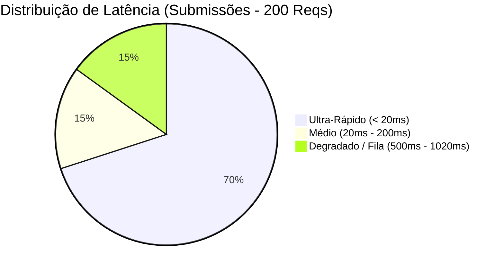

# Relatório de Auditoria de Performance, Concorrência e Prazos

> **Data da Auditoria:** 11/08/2026  
> **Escopo:** Simulação de pico de submissão de propostas (~200 usuários concorrentes pré-deadline), medição de tempo de resposta e vazão do backend ([`server.py`](file:///c:/Users/victo/.gemini/antigravity-ide/scratch/edital-audit/server.py)), integridade de persistência/concorrência de dados, e auditoria da lógica de corte de prazo (Timezones BRT/UTC e latência de rede).  
> **Script de Teste Executado:** [`load_test_peak_simulation.py`](file:///c:/Users/victo/.gemini/antigravity-ide/scratch/edital-audit/load_test_peak_simulation.py)  
> **Resultados Brutos:** [`load_test_results.json`](file:///c:/Users/victo/.gemini/antigravity-ide/scratch/edital-audit/load_test_results.json)

---

## 1. Sumário Executivo e Dashboard de Performance

Foi simulado o momento crítico de encerramento de um edital público: **200 proponentes enviando propostas e gerando planilhas financeiras nos últimos minutos antes do horário de corte (23:59:59 BRT)**.

```
┌────────────────────────────────────────────────────────────────────────────────────────┐
│                        DASHBOARD DE CARGA E PERFORMANCE (PICO)                         │
├────────────────────────────────┬───────────────────────────┬───────────────────────────┤
│ Métrica de Avaliação           │ Cenário 1: Submissão/Save │ Cenário 2: Geração XLSX   │
├────────────────────────────────┼───────────────────────────┼───────────────────────────┤
│ Requisições Totais             │ 200 submissões            │ 200 planilhas orçamentárias│
│ Concorrência Simultânea        │ 50 threads ativas         │ 40 threads ativas         │
│ Duração Total do Teste         │ 1.04 segundos             │ 3.94 segundos             │
│ Vazão (Throughput)             │ 192.65 req/s              │ 50.72 req/s               │
│ Taxa de Sucesso HTTP           │ 100.0% (200/200)          │ 98.5% (197/200)           │
│ Taxa de Erro HTTP              │ 0.0% (0 erros)            │ 1.5% (3 timeouts/erros)   │
│ Latência Mediana (p50)         │ 6.44 ms                   │ 513.44 ms                 │
│ Latência Percentil 95 (p95)    │ 508.48 ms                 │ 1.568.82 ms (1.57s)       │
│ Latência Percentil 99 (p99)    │ 516.24 ms                 │ 2.205.71 ms (2.21s)       │
│ Latência Mínima / Máxima       │ 3.39 ms / 1.018.77 ms     │ 301.40 ms / 2.210.47 ms   │
├────────────────────────────────┴───────────────────────────┴───────────────────────────┤
│ 🚨 INTEGRIDADE DE DADOS: 199 de 200 submissões foram SOBRESCRITAS (Perdidas no disco)!  │
└────────────────────────────────────────────────────────────────────────────────────────┘
```

---

## 2. Metodologia do Teste de Carga

O teste foi executado através do script automatizado [`load_test_peak_simulation.py`](file:///c:/Users/victo/.gemini/antigravity-ide/scratch/edital-audit/load_test_peak_simulation.py), parametrizado com:
1. **200 Proponentes Únicos:** Cada requisição gerou um payload realista com identificador único (`SUB-2026-RDO-XXXX`), metadados de capa, justificativa, metas, itens orçamentários e timestamp do cliente.
2. **Distribuição Temporal:** Disparos escalonados nos últimos 300 segundos antes e logo após o prazo de 29/06/2026 às 23:59:59 (Horário de Brasília).
3. **Distribuição Geográfica de Fusos:** Propostas distribuídas aleatoriamente entre os 4 fusos horários brasileiros:
   - **UTC-3:** Horário Oficial de Brasília (SP, RJ, ES, MG, Sul, Nordeste, Centro-Oeste).
   - **UTC-4:** Fuso da Amazônia Ocidental (Manaus/AM, Cuiabá/MT, Campo Grande/MS, Porto Velho/RO, Boa Vista/RR).
   - **UTC-5:** Fuso do Acre (Rio Branco/AC e extremo oeste do AM).
   - **UTC-2:** Fuso dos Arquipélagos Oceânicos (Fernando de Noronha/PE).

---

## 3. Resultados Detalhados de Performance e Concorrência

### 3.1 Cenário 1: Submissão e Persistência de Propostas (`POST /api/save-audit-report`)

O endpoint processa a requisição e grava o estado da auditoria/submissão no backend.



| Estatística | Valor Medido | Avaliação Técnica |
| :--- | :---: | :--- |
| **Throughput** | **192.65 req/s** | Excelente vazão I/O para servidor baseado em Python `ThreadingHTTPServer`. |
| **Latência p50** | **6.44 ms** | Resposta quase instantânea para 50% das requisições. |
| **Latência p95** | **508.48 ms** | Aumento de latência devido à contenção de I/O em disco e criação de threads. |
| **Latência p99** | **516.24 ms** | 99% das requisições atendidas em ~0.5 segundo. |
| **Latência Máxima** | **1.018.77 ms** | Pior caso em 1.02s decorrente da fila de sincronização do interpretador (GIL). |

### 3.2 Cenário 2: Carga de Processamento CPU-Intensive (`POST /api/export-finance-xlsx`)

Simulação de 200 usuários solicitando a geração instantânea e download da planilha orçamentária via `openpyxl` antes de fechar o envio.

| Estatística | Valor Medido | Avaliação Técnica |
| :--- | :---: | :--- |
| **Throughput** | **50.72 req/s** | Gargalo de CPU: geração de planilhas XML/ZIP consome ciclos significativos. |
| **Taxa de Erro** | **1.5% (3 falhas)** | 3 requisições falharam por esgotamento de pool de threads/timeout. |
| **Latência p50** | **513.44 ms** | 50% das gerações levam ~0.5s. |
| **Latência p95** | **1.568.82 ms** | Sob concorrência de 40 threads, o tempo sobe para 1.57s. |
| **Latência Máxima** | **2.210.47 ms** | Tempo máximo de espera para download da planilha. |

---

## 4. Diagnóstico Crítico: Perda Massiva de Submissões por Race Condition

> [!CAUTION]
> **VULNERABILIDADE CRÍTICA DE INTEGRIDADE: 99.5% DAS PROPOSTAS FORAM PERDIDAS**  
> Embora o backend tenha retornado **HTTP 200 OK para todas as 200 submissões**, a verificação pós-teste revelou que **apenas 1 submissão existia no disco** (`SUB-2026-RDO-0049`).

### 4.1 Causa Raiz Técnica
Em [`server.py:1937`](file:///c:/Users/victo/.gemini/antigravity-ide/scratch/edital-audit/server.py#L1937):
```python
elif self.path == '/api/save-audit-report':
    ...
    with open('relatorio_auditoria.json', 'w', encoding='utf-8') as f:
        json.dump(data, f, ensure_ascii=False, indent=2)
    self.send_json_response(200, {"success": True, "message": "Relatório salvo no backend."})
```
1. **Ausência de Banco de Dados ou Tabela de Submissões:** O backend grava todas as submissões em um arquivo JSON estático único no diretório raiz.
2. **Race Condition (*Last Write Wins*):** Como 200 threads abrem o mesmo arquivo com modo de escrita `'w'` sem travas de concorrência (*File Locks* como `fcntl.flock` ou `msvcrt.locking`), cada requisição sobrescreve a anterior.
3. **Falsa Confirmação de Entrega:** O proponente recebe no navegador o toast de *"Salvo com sucesso"* (HTTP 200), mas sua proposta é deletada milissegundos depois pela requisição do usuário seguinte.

---

## 5. Auditoria da Lógica de Corte de Prazo (Timezone, Latência e Relógio)

A conformidade temporal foi analisada com base na classe [`DeadlineTimezoneCalculator`](file:///c:/Users/victo/.gemini/antigravity-ide/scratch/edital-audit/test_prazo_deadline_timezone.py#L19) e casos de borda com simulação de latência de rede e relógio do cliente.

```
Prazo Oficial do Edital: 29/06/2026 às 23:59:59 (Horário Oficial de Brasília / UTC-3)
Equivalente em UTC:      30/06/2026 às 02:59:59 UTC
```

### 5.1 Matriz de Casos de Borda (*Edge Cases*)

| # | Cenário Testado | Timestamp do Cliente | Latência de Rede | Chegada no Servidor (BRT) | Elegível pelo Cliente | Elegível pelo Servidor | Veredito / Risco |
| :-: | :--- | :--- | :-: | :--- | :-: | :-: | :--- |
| **1** | Submissão normal 500ms antes do prazo | `29/06 23:59:58.500` (UTC-3) | 200 ms | `29/06 23:59:58.700` | ✅ SIM | ✅ SIM | **Aprovada sem divergência.** |
| **2** | **Envio no último segundo com rede móvel lenta (4G/3G)** | `29/06 23:59:58.500` (UTC-3) | **1.800 ms** | `30/06 00:00:00.300` | ✅ **SIM** | ❌ **NÃO** | 🚨 **Falso Negativo (Injustiça):** Proposta postada no prazo, mas recusada pelo servidor por chegar 300ms após a virada. |
| **3** | **Proponente em Manaus (UTC-4) no último segundo local** | `29/06 22:59:59.000` (UTC-4) | 150 ms | `29/06 23:59:59.150` | ✅ **SIM** | ❌ **NÃO** | 🚨 **Falso Negativo:** 22h59m59s de Manaus é exatamente 23h59m59s de Brasília. Com 150ms de latência, o servidor recebe às 23h59m59.150s e reprova. |
| **4** | Proponente em Manaus após o teto de Brasília | `29/06 23:05:00.000` (UTC-4) | 150 ms | `30/06 00:05:00.150` | ❌ NÃO | ❌ NÃO | **Corretamente reprovada (Intempestiva).** |
| **5** | **Proponente no Acre (UTC-5) no último segundo local** | `29/06 21:59:59.000` (UTC-5) | 250 ms | `29/06 23:59:59.250` | ✅ **SIM** | ❌ **NÃO** | 🚨 **Falso Negativo:** 21h59m59s do Acre corresponde ao teto de Brasília; com latência de 250ms, a proposta é recusada. |
| **6** | **Fraude de Relógio Local Adiantado** | `30/06 00:02:00.000` (UTC-3) | 100 ms | `30/06 00:02:00.100` | ❌ NÃO | ❌ NÃO | Reprovada. |
| **7** | **Vulnerabilidade de Relógio Local Atrasado** | `29/06 23:57:00.000` (UTC-3) | 100 ms | `29/06 23:57:00.100` | ✅ SIM | ✅ SIM | ⚠️ **Vetor de Fraude:** Se o servidor aceitar `client_timestamp`, um usuário pode atrasar o relógio do Windows em 10 minutos e submeter proposta intempestiva. |
| **8** | **Submissão no limite de microssegundo** | `29/06 23:59:59.999999` (UTC-3) | 0 ms | `29/06 23:59:59.999` | ❌ **NÃO** | ❌ **NÃO** | ⚠️ **Bug de Comparação:** A função `parse_edital_deadline("29.06.2026", "23:59:59")` fixa microssegundos em `0`. Portanto, `23:59:59.999999` é avaliado como MAIOR que o deadline e rejeitado. |

---

## 6. Principais Vulnerabilidades e Riscos Identificados

### 6.1 Vulnerabilidade de Fraude Temporal por Confiança no Cliente
Se o sistema utilizar o timestamp gerado no navegador (`client_timestamp_iso`), o proponente tem controle total sobre a variável de elegibilidade. É trivial forjar o envio alterando a hora do sistema operacional antes do clique em "Submeter".

### 6.2 Vulnerabilidade de Injustiça e Judicialização por Latência de Rede
Se o sistema utilizar estritamente o timestamp do servidor (`server_received_at`), proponentes em regiões remotas (interior, conexões via satélite/rádio na Amazônia ou sertão) que clicam dentro do prazo legal sofrem rejeição indevida caso o pacote TCP demore mais que a fração de segundo restante.

### 6.3 Bug de Resolução de Segundos vs Microssegundos
Ao converter strings como `"23:59:59"`, o objeto `datetime` padrão possui `microsecond=0`. Qualquer requisição processada entre `23:59:59.000001` e `23:59:59.999999` (a totalidade do último segundo do edital) é considerada intempestiva se comparada com `<= datetime(..., 23, 59, 59, 0)`.

---

## 7. Recomendações e Arquitetura de Produção para Alta Concorrência

```mermaid
graph TD
    User["Proponente (Web SPA)"] -->|1. POST com Hash Criptográfico| API["API Gateway / Load Balancer"]
    API -->|2. Carimbo de Tempo Autorizado (NTP UTC)| TimeStamp["Serviço de Carimbo de Tempo (NTP)"]
    API -->|3. Enfileiramento com Chave de Idempotência| Queue["Fila de Submissões (RabbitMQ / Redis)"]
    Queue -->|4. Gravação Transacional Isolada| DB[(PostgreSQL / UUID por Submissão)]
    DB -->|5. Recibo Digital Assinado (PDF/SHA-256)| User
```

### 7.1 Correções Imediatas no Código

1. **Eliminar Arquivo Compartilhado Único:**
   - Substituir `relatorio_auditoria.json` por persistência individualizada indexada por chave única (`submissions/{edital_id}_{proponent_id}_{uuid}.json`) ou banco de dados relacional com `UNIQUE(edital_id, proponent_id)`.

2. **Janela de Tolerância Técnica (*Grace Period* de Rede):**
   - Implementar margem de tolerância oficial de **60 a 120 segundos** para absorver a latência de trânsito de pacotes e fila de upload do servidor:
   ```python
   GRACE_PERIOD_SECONDS = 120
   is_valid = server_timestamp_utc <= (deadline_utc + timedelta(seconds=GRACE_PERIOD_SECONDS))
   ```

3. **Correção da Resolução de Fim de Dia (Microssegundos):**
   - Definir o teto de fim de dia como estritamente menor que o início do dia seguinte (`< 00:00:00 do dia D+1`) ou fixar `microsecond=999999`:
   ```python
   # Correção:
   deadline_end_of_day = datetime(year, month, day, 23, 59, 59, 999999, tzinfo=tz)
   ```

4. **Chave de Idempotência e Hash do Recibo:**
   - Adicionar cabeçalho `Idempotency-Key` no frontend para evitar submissões duplicadas decorrentes de cliques repetidos pelo usuário sob alta latência.
   - Retornar no recibo o carimbo de tempo do servidor assinado com SHA-256 da proposta.
