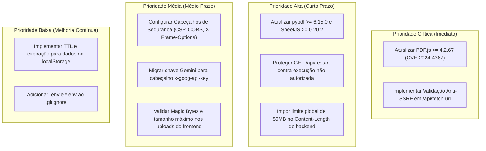

# Relatório de Auditoria de Segurança e Conformidade

> **Data da Auditoria:** 11/08/2026  
> **Escopo:** Varredura de vulnerabilidades de dependências ([`npm audit`](file:///c:/Users/victo/.gemini/antigravity-ide/scratch/edital-audit/index.html) / [`osv-scanner`](file:///c:/Users/victo/.gemini/antigravity-ide/scratch/edital-audit/requirements.txt)), cabeçalhos HTTP ([`server.py`](file:///c:/Users/victo/.gemini/antigravity-ide/scratch/edital-audit/server.py)), transporte e ciclo de vida de tokens ([`services/api.py`](file:///c:/Users/victo/.gemini/antigravity-ide/scratch/edital-audit/services/api.py)), validação de upload de arquivos ([`app.js`](file:///c:/Users/victo/.gemini/antigravity-ide/scratch/edital-audit/app.js)), e revisão de controle de acesso (RBAC / SSRF).  
> **Status de Alteração:** *Relatório consolidado e priorizado por severidade.*

---

## Matriz Resumo de Vulnerabilidades por Severidade

| Severidade | Quantidade | Principais Vetores Identificados |
| :--- | :---: | :--- |
| 🔴 **CRÍTICA** | **2** | Execução Remota de Código/XSS via PDF malicioso (`CVE-2024-4367` no PDF.js) e SSRF irrestrito no backend (`/api/fetch-url`). |
| 🟠 **ALTA** | **4** | Negação de Serviço por Loop Infinito (`CVE-2026-59935`/`59936` no `pypdf`), Poluição de Protótipo no SheetJS (`CVE-2023-30533`), Rota Administrativa Aberta (`GET /api/restart`), e Esgotamento de Memória por Payload Ilimitado. |
| 🟡 **MÉDIA** | **5** | Traversal em DOCX (`CVE-2025-11849`), DoS por ReDoS no SheetJS (`CVE-2024-22363`), Ausência Total de Headers de Segurança (CSP/CORS/X-Frame-Options), Chave de API exposta em Query Parameters, e Falta de Validação de Magic Bytes / Tamanho no Upload. |
| 🟢 **BAIXA** | **3** | Ausência de Expiração/TTL em Tokens no `localStorage`, Persistência Monousuário Compartilhada em arquivo estático, e Comunicação Local em HTTP sem TLS. |
| ℹ️ **INFORMATIVA** | **2** | Ausência de `.env` no [`.gitignore`](file:///c:/Users/victo/.gemini/antigravity-ide/scratch/edital-audit/.gitignore), e logs de depuração contendo dados contextuais. |

---

## 1. Auditoria de Dependências (`npm audit` & `osv-scanner`)

A análise de composição de software (SCA) foi executada combinando o inventário de pacotes Python ([`requirements.txt`](file:///c:/Users/victo/.gemini/antigravity-ide/scratch/edital-audit/requirements.txt) e ambiente `.venv`) e bibliotecas JavaScript vendoreadas/CDN em [`index.html`](file:///c:/Users/victo/.gemini/antigravity-ide/scratch/edital-audit/index.html), consultando a base de dados **Open Source Vulnerabilities (OSV.dev / PyPA / GitHub Security Advisory Database)**.

Foram identificadas **16 vulnerabilidades** ativas no ecossistema:

### 1.1 Dependências Frontend (JavaScript / CDN / Vendored)

| Pacote | Versão Atual | CVE / Advisory | Severidade | Descrição do Impacto | Correção Recomendada |
| :--- | :---: | :---: | :---: | :--- | :--- |
| **PDF.js** ([`index.html:1146`](file:///c:/Users/victo/.gemini/antigravity-ide/scratch/edital-audit/index.html#L1146)) | `3.4.120` | **CVE-2024-4367**<br>(`GHSA-wgrm-67xf-hhpq`) | 🔴 **CRÍTICA**<br>(CVSS 8.8) | **Execução Arbitrária de JavaScript (RCE/XSS no Navegador):** Ao abrir um PDF malicioso com fontes manipuladas, o PDF.js executa JavaScript arbitrário no contexto da aplicação caso `isEvalSupported` esteja ativo (padrão). | Atualizar CDN para `pdfjs-dist >= 4.2.67` e definir `isEvalSupported: false`. |
| **SheetJS (xlsx)** ([`src/xlsx.full.min.js`](file:///c:/Users/victo/.gemini/antigravity-ide/scratch/edital-audit/src/xlsx.full.min.js)) | `0.18.5` | **CVE-2023-30533**<br>(`GHSA-4r6h-8v6p-xvw6`) | 🟠 **ALTA**<br>(CVSS 7.8) | **Prototype Pollution:** Manipulação do protótipo de objetos JavaScript globais através de planilhas Excel especialmente formatadas. | Atualizar para `xlsx >= 0.20.2` e sanitizar chaves de objetos importados. |
| **SheetJS (xlsx)** ([`src/xlsx.full.min.js`](file:///c:/Users/victo/.gemini/antigravity-ide/scratch/edital-audit/src/xlsx.full.min.js)) | `0.18.5` | **CVE-2024-22363**<br>(`GHSA-5pgg-2g8v-p4x9`) | 🟡 **MÉDIA**<br>(CVSS 6.2) | **Regular Expression Denial of Service (ReDoS):** Travamento do processamento do navegador ao parsear fórmulas ou células com regexes vulneráveis. | Atualizar para versão corrigida (`>= 0.20.2`). |
| **Mammoth.js** ([`index.html:1147`](file:///c:/Users/victo/.gemini/antigravity-ide/scratch/edital-audit/index.html#L1147)) | `1.6.0` | **CVE-2025-11849**<br>(`GHSA-rmjr-87wv-gf87`) | 🟡 **MÉDIA**<br>(CVSS 5.3) | **Directory Traversal em Arquivos DOCX:** Extração de caminhos e referências internas em documentos DOCX manipulados. | Atualizar CDN para `mammoth >= 1.11.0`. |

### 1.2 Dependências Backend (Python / PyPI)

| Pacote | Versão Instalada | CVE / Advisory | Severidade | Descrição do Impacto | Correção Recomendada |
| :--- | :---: | :---: | :---: | :--- | :--- |
| **pypdf** ([`requirements.txt:5`](file:///c:/Users/victo/.gemini/antigravity-ide/scratch/edital-audit/requirements.txt#L5)) | `6.13.3` | **CVE-2026-59935**<br>(`GHSA-g867-7843-wf8q`) | 🟠 **ALTA** | **Infinite Loop DoS:** Loop infinito no backend ao processar fluxos de imagem embutida não terminados com filtros ASCII85/ASCIIHex. | Atualizar para `pypdf >= 6.15.0`. |
| **pypdf** | `6.13.3` | **CVE-2026-59936**<br>(`GHSA-5xf7-4p34-54qr`) | 🟠 **ALTA** | **Infinite Loop DoS:** Travamento permanente da thread do servidor ao parsear conteúdo de página de PDF com imagem malformada. | Atualizar para `pypdf >= 6.15.0`. |
| **pypdf** | `6.13.3` | **CVE-2026-71870**<br>(`GHSA-fp3f-mc75-235c`) | 🟡 **MÉDIA** | **Memory Exhaustion DoS:** Consumo massivo de memória ao parsear tabelas `/ToUnicode` de fontes maliciosas. | Atualizar para `pypdf >= 6.15.0`. |
| **pypdf** | `6.13.3` | **CVE-2026-71852**<br>(`GHSA-fwg2-594c-jp42`) | 🟡 **MÉDIA** | **CPU/Memory DoS:** Esgotamento de recursos em faixas de largura de fontes CID excepcionalmente grandes. | Atualizar para `pypdf >= 6.15.0`. |
| **pypdf** | `6.13.3` | **CVE-2026-59937**<br>(`GHSA-55h5-xmcq-c37v`) | 🟡 **MÉDIA** | **Long Runtimes DoS:** Execução prolongada por entradas de referência cruzada repetidas e corrompidas. | Atualizar para `pypdf >= 6.15.0`. |
| **pypdf** | `6.13.3` | **CVE-2026-59938**<br>(`GHSA-5qjq-93h5-hrgp`) | 🟡 **MÉDIA** | **Memory Usage:** Alocação excessiva de buffers para imagens com dimensões declaradas inconsistentes. | Atualizar para `pypdf >= 6.15.0`. |

---

## 2. Auditoria de Cabeçalhos de Segurança (CSP, CORS e Hardening)

A inspeção do método [`end_headers()`](file:///c:/Users/victo/.gemini/antigravity-ide/scratch/edital-audit/server.py#L650) em [`server.py`](file:///c:/Users/victo/.gemini/antigravity-ide/scratch/edital-audit/server.py) e dos cabeçalhos HTML em [`index.html`](file:///c:/Users/victo/.gemini/antigravity-ide/scratch/edital-audit/index.html) revelou **ausência total de cabeçalhos de defesa em profundidade**.

```python
# Trecho atual em server.py (linhas 650-655):
def end_headers(self):
    self.send_header('Cache-Control', 'no-store, no-cache, must-revalidate, max-age=0')
    self.send_header('Pragma', 'no-cache')
    self.send_header('Expires', '0')
    super().end_headers()
```

### 2.1 Diagnóstico de Cabeçalhos

| Cabeçalho de Segurança | Status Atual | Nível de Risco | Impacto / Vulnerabilidade Associada |
| :--- | :---: | :---: | :--- |
| **Content-Security-Policy (CSP)** | ❌ **Ausente** | 🔴 **Crítico** | Permite injeção de scripts externos, execução de `eval()`, frames arbitrários e conexões não autorizadas (`connect-src *`). |
| **Cross-Origin Resource Sharing (CORS)** | ❌ **Não configurado** | 🟡 **Médio** | O servidor não valida o cabeçalho `Origin` em requisições `POST`. Sites de terceiros acessados pelo navegador podem forjar requisições contra `http://127.0.0.1:8000/api/...` (CSRF em localhost). |
| **X-Content-Type-Options** | ❌ **Ausente** | 🟡 **Médio** | Risco de ataques de MIME Sniffing pelo navegador em uploads de arquivos e endpoints de API. |
| **X-Frame-Options** | ❌ **Ausente** | 🟡 **Médio** | Permite que a aplicação seja embutida em `<iframe>` por domínios terceiros, possibilitando ataques de **Clickjacking**. |
| **Referrer-Policy** | ❌ **Ausente** | 🟢 **Baixo** | Pode vazar caminhos e metadados internos em links externos ou requisições para a web. |
| **Permissions-Policy** | ❌ **Ausente** | 🟢 **Baixo** | Não restringe o acesso a recursos do hardware do dispositivo (câmera, microfone, geolocalização). |

### 2.2 Configuração Recomendada para o [`server.py`](file:///c:/Users/victo/.gemini/antigravity-ide/scratch/edital-audit/server.py)
```python
def end_headers(self):
    self.send_header('Cache-Control', 'no-store, no-cache, must-revalidate, max-age=0')
    self.send_header('Pragma', 'no-cache')
    self.send_header('Expires', '0')
    self.send_header('X-Content-Type-Options', 'nosniff')
    self.send_header('X-Frame-Options', 'DENY')
    self.send_header('Referrer-Policy', 'strict-origin-when-cross-origin')
    self.send_header('Permissions-Policy', 'geolocation=(), camera=(), microphone=()')
    self.send_header('Content-Security-Policy', (
        "default-src 'self'; "
        "script-src 'self' 'unsafe-inline' https://cdnjs.cloudflare.com; "
        "style-src 'self' 'unsafe-inline' https://fonts.googleapis.com; "
        "font-src 'self' https://fonts.gstatic.com; "
        "img-src 'self' data: blob:; "
        "connect-src 'self' https://generativelanguage.googleapis.com http://localhost:11434; "
        "object-src 'none'; "
        "frame-ancestors 'none';"
    ))
    super().end_headers()
```

---

## 3. Auditoria de Transporte (HTTPS) e Ciclo de Vida de Tokens/Sessões

### 3.1 Transporte e Criptografia em Trânsito
- **Servidor Local:** O backend roda via `ThreadingHTTPServer(('127.0.0.1', 8000))` sem camada SSL/TLS (`http://127.0.0.1:8000`). Para uso desktop monousuário em localhost o risco é contido, mas caso a aplicação seja disponibilizada em rede (ex: `0.0.0.0`), todo o tráfego de editais e minutas transita em texto plano.
- **Chamadas de Saída para Provedores de IA:**
  - As chamadas para a API do Google Gemini em [`services/api.py:413`](file:///c:/Users/victo/.gemini/antigravity-ide/scratch/edital-audit/services/api.py#L413) utilizam **HTTPS** (`https://generativelanguage.googleapis.com/...`).
  - As chamadas para o Ollama local utilizam `http://localhost:11434` (esperado para daemons locais).
  - O proxy [`/api/fetch-url`](file:///c:/Users/victo/.gemini/antigravity-ide/scratch/edital-audit/server.py#L657) não força HTTPS, aceitando links `http://` sem aviso de segurança.

### 3.2 Vulnerabilidade de Exposição de Chave de API em URL Query Parameters
> [!WARNING]
> Em [`services/api.py:413`](file:///c:/Users/victo/.gemini/antigravity-ide/scratch/edital-audit/services/api.py#L413), a chave de API é concatenada na query string:
> ```python
> url = f"https://generativelanguage.googleapis.com/v1beta/models/{current_model}:streamGenerateContent?key={api_key}"
> ```
> **Risco:** Chaves de API transmitidas na query string são registradas em logs de acesso de proxies, servidores intermediários e relatórios de erro.  
> **Correção:** Transmitir a chave de API exclusivamente através do cabeçalho HTTP:
> ```python
> headers = {
>     "Content-Type": "application/json",
>     "x-goog-api-key": api_key
> }
> ```

### 3.3 Ciclo de Vida e Expiração de Tokens/Sessão
- **Ausência de TTL (Time-To-Live) / Expiração:** A chave de API (`gemini_api_key`) e o estado de trabalho são armazenados em `localStorage` ([`src/controllers/stateIntegrityManager.js:119`](file:///c:/Users/victo/.gemini/antigravity-ide/scratch/edital-audit/src/controllers/stateIntegrityManager.js#L119)) e no `IndexedDB` **sem prazo de expiração**.
- **Inexistência de Mecanismo de Revogação / Logout:** Não há rotina de invalidação de sessão ou expiração automática por inatividade.
- **Armazenamento Não Criptografado no Cliente:** Chaves e dados confidenciais de propostas permanecem descriptografados no armazenamento do navegador.

---

## 4. Auditoria de Upload de Arquivos e Processamento de Documentos

A análise dos manipuladores de arquivos em [`app.js`](file:///c:/Users/victo/.gemini/antigravity-ide/scratch/edital-audit/app.js) ([`extractTextFromFile`](file:///c:/Users/victo/.gemini/antigravity-ide/scratch/edital-audit/app.js#L2066), [`processEditalFile`](file:///c:/Users/victo/.gemini/antigravity-ide/scratch/edital-audit/app.js#L1316), [`processDraftFile`](file:///c:/Users/victo/.gemini/antigravity-ide/scratch/edital-audit/app.js#L1334) e [`processAnnexFile`](file:///c:/Users/victo/.gemini/antigravity-ide/scratch/edital-audit/app.js#L2018)) identificou os seguintes pontos críticos:

### 4.1 Validação de Tipo e Extensão
- **Mecanismo Atual:** A validação é realizada puramente por extensão de arquivo e cabeçalho `file.type` ([`app.js:2074-2080`](file:///c:/Users/victo/.gemini/antigravity-ide/scratch/edital-audit/app.js#L2074-L2080)):
  ```javascript
  const rejectedExtensions = ['.exe', '.bin', '.dll', '.zip', '.rar', '.7z', ...];
  const isPdf = mimeType === 'application/pdf' || fileExt === '.pdf';
  const isDocx = mimeType === 'application/vnd.openxmlformats-officedocument.wordprocessingml.document' || fileExt === '.docx';
  ```
- **Vulnerabilidade (Falta de Magic Bytes):** O sistema não inspeciona os primeiros bytes do arquivo (*Magic Numbers*). Um arquivo executável renomeado para `.pdf` ou um arquivo malicioso `.svg` com script embutido passa pela checagem inicial.
  - **Bytes esperados para PDF:** `%PDF-` (`0x25 0x50 0x44 0x46 0x2D`)
  - **Bytes esperados para DOCX:** `PK\x03\x04` (`0x50 0x4B 0x03 0x04`)

### 4.2 Limite de Tamanho Máximo (*Maximum File Size*)
- **Frontend ([`app.js`](file:///c:/Users/victo/.gemini/antigravity-ide/scratch/edital-audit/app.js)):** **Não existe verificação de tamanho máximo** antes de carregar o arquivo na memória (`FileReader.readAsArrayBuffer(file)`). Se o usuário fizer upload de um arquivo de 1 GB, o navegador alocará memória até causar travamento da aba (*Out of Memory*).
- **Backend ([`server.py`](file:///c:/Users/victo/.gemini/antigravity-ide/scratch/edital-audit/server.py)):** Em todos os endpoints `do_POST`, a leitura de `self.rfile.read(content_length)` não valida se `content_length` excede um limite seguro, expondo o servidor a ataques de exaustão de buffer.

### 4.3 Checagens contra Arquivos Maliciosos (Malware, Zip Bomb e Exploits)
- **Zip Bombs / Decompression Bombs:** Arquivos `.docx` são arquivos compactados ZIP. O parser Mammoth não impõe limites de razão de descompressão (*Decompression Ratio Limit*). Um documento de 50 KB expandindo para 10 GB causará travamento imediato.
- **Vetor de Execução PDF via CVE-2024-4367:** O leitor PDF.js integrado executa funções internas vulneráveis sem sandbox isolado.

---

## 5. Revisão de Controle de Acesso e Riscos de Backend

Sob a perspectiva de segurança de aplicação web, os achados de controle de acesso do backend consolidam riscos de alta severidade:

### 5.1 Ausência de Autenticação e RBAC no Backend ([`server.py`](file:///c:/Users/victo/.gemini/antigravity-ide/scratch/edital-audit/server.py))
- O backend não possui camada de autenticação (JWT, Session Cookie, API Key de serviço ou verificação de cabeçalho `Authorization`).
- **Endpoint Administrativo Inseguro (`GET /api/restart` — Linha 630):** Qualquer requisição HTTP pode invocar `os.execv` e forçar o reinício do interpretador Python, viabilizando Negação de Serviço (DoS) direta.

### 5.2 Server-Side Request Forgery (SSRF)
- **Endpoints:** [`/api/fetch-url`](file:///c:/Users/victo/.gemini/antigravity-ide/scratch/edital-audit/server.py#L657) e [`/api/parse-portal-page`](file:///c:/Users/victo/.gemini/antigravity-ide/scratch/edital-audit/server.py#L745).
- **Vulnerabilidade:** O backend recebe parâmetros de URL enviados pelo cliente e executa `urllib.request.urlopen(req)` sem validar se o IP de destino é público ou privado.
- **Risco:** Um invasor pode disparar requisições contra serviços internos (`http://127.0.0.1:8000/api/restart`, roteadores locais `192.168.1.1`, bancos de dados internos, ou endpoints de metadados em nuvem `169.254.169.254`).

### 5.3 Persistência Compartilhada Monousuário
- **Endpoints:** [`/api/save-audit-report`](file:///c:/Users/victo/.gemini/antigravity-ide/scratch/edital-audit/server.py#L1932) e [`/api/load-audit-report`](file:///c:/Users/victo/.gemini/antigravity-ide/scratch/edital-audit/server.py#L1943).
- **Vulnerabilidade:** Todos os dados de auditoria são persistidos em um arquivo único `relatorio_auditoria.json`. Não há isolamento por sessão ou usuário (IDOR/Shared State), permitindo que qualquer usuário sobrescreva e leia relatórios alheios.

---

## 6. Plano de Ação Priorizado de Remediação



### Checklist Detalhado de Implementação

1. **[CRÍTICO] Atualizar Biblioteca PDF.js:**
   - Em [`index.html:1146`](file:///c:/Users/victo/.gemini/antigravity-ide/scratch/edital-audit/index.html#L1146), substituir `pdfjs-dist@3.4.120` por versão patched `4.2.67+`.
   - Em [`app.js:2125`](file:///c:/Users/victo/.gemini/antigravity-ide/scratch/edital-audit/app.js#L2125), configurar `{ isEvalSupported: false }` nas opções de inicialização do PDF.js.

2. **[CRÍTICO] Filtro Anti-SSRF no Backend:**
   - Adicionar resolução de DNS e bloqueio de IPs privados (`10.0.0.0/8`, `172.16.0.0/12`, `192.168.0.0/16`, `127.0.0.0/8`, `169.254.169.254`) antes de disparar `urlopen` em [`server.py`](file:///c:/Users/victo/.gemini/antigravity-ide/scratch/edital-audit/server.py).

3. **[ALTO] Atualizar `pypdf`, `openpyxl` e `xlsx`:**
   - Executar `pip install pypdf>=6.15.0` e atualizar o pacote `src/xlsx.full.min.js` para a versão `0.20.2+`.

4. **[ALTO] Teto Máximo de Leitura HTTP:**
   - Em [`server.py`](file:///c:/Users/victo/.gemini/antigravity-ide/scratch/edital-audit/server.py), rejeitar requisições com `Content-Length > 50 * 1024 * 1024` com status HTTP 413 (*Payload Too Large*).

5. **[MÉDIO] Cabeçalhos de Segurança:**
   - Adicionar `Content-Security-Policy`, `X-Content-Type-Options: nosniff` e `X-Frame-Options: DENY` no método `end_headers` de [`server.py`](file:///c:/Users/victo/.gemini/antigravity-ide/scratch/edital-audit/server.py).

6. **[MÉDIO] Validação de Magic Bytes no Frontend:**
   - Em [`app.js`](file:///c:/Users/victo/.gemini/antigravity-ide/scratch/edital-audit/app.js), verificar os primeiros 4 bytes do `ArrayBuffer` (`0x25 0x50 0x44 0x46` para PDF e `0x50 0x4B 0x03 0x04` para DOCX) e impor limite máximo de 35 MB por arquivo no navegador.
