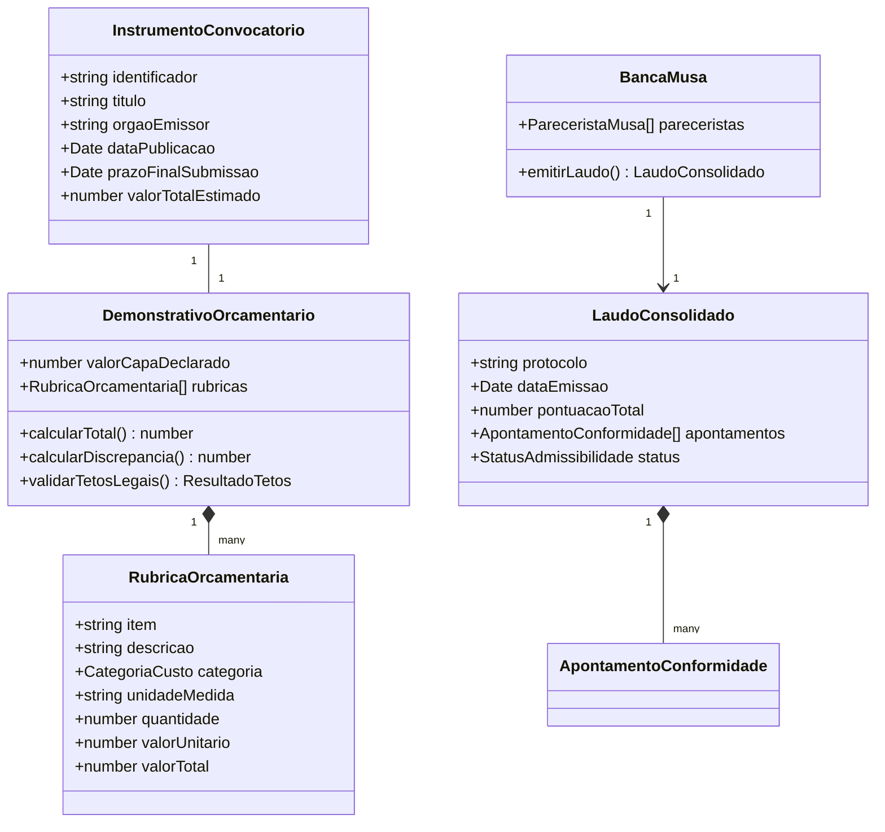

# CONTEXT.md — Mapa de Domínio e Linguagem Ubíqua (DDD)

> **Projeto:** EditalAudit AI  
> **Versão:** 3.0.0  
> **Status:** Canônico / Fase 2 (Arquitetura e Modelagem)  
> **Fundamentação Legal:** Lei 14.133/2021 (Licitações), Lei 14.903/2024 (Marco Legal da Cultura), Decreto 11.453/2023 e Súmulas do TCU.

---

## 🏛️ 1. O Problema do Domínio

Proponentes culturais e servidores públicos enfrentam **glosas orçamentárias**, **impugnações de editais** e **inabilitações formais** devido a:
1. Discrepâncias aritméticas entre valores declarados em formulários ("capa") e o somatório analítico da planilha de custos.
2. Inobservância de tetos legais compulsórios (ex: 15% para custos administrativos, 10% para divulgação).
3. Aplicação incorreta de Benefícios e Despesas Indiretas (BDI/LDI) sobre itens vedados pela jurisprudência (Súmula TCU 272).
4. Erros no cômputo de prazos preclusivos para impugnação, esclarecimento e recursos.

---

## 📖 2. Dicionário de Linguagem Ubíqua (Glossário Canônico)

Para evitar termos genéricos como `item`, `data`, `parser`, `user`, `result`, todos os módulos, variáveis e tabelas devem seguir rigorosamente o vocabulário abaixo:

| Termo do Domínio | O que é no Mundo Real | Tradução no Código / Variável |
| :--- | :--- | :--- |
| **Instrumento Convocatório / Edital** | O documento oficial publicado pelo poder público que rege o certame. | `InstrumentoConvocatorio` / `Edital` |
| **Objeto do Edital** | A finalidade artística, técnica ou institucional a ser contratada/fomentada. | `ObjetoEdital` |
| **Proposta de Preços / Planilha** | A relação detalhada de todos os custos propostos pelo proponente. | `DemonstrativoOrcamentario` / `PlanilhaOrcamentaria` |
| **Rubrica Orçamentária** | Uma linha de despesa discriminada (unidade, quantidade, valor unitário). | `RubricaOrcamentaria` |
| **Categoria de Custo** | Agrupamento funcional da despesa (RH, Produção, Administração, Divulgação). | `CategoriaCusto` |
| **Valor Declarado na Capa** | O valor total que o proponente preencheu no formulário de inscrição. | `ValorCapaDeclarado` |
| **Valor Analítico Calculado** | A soma aritmética real de `Quantidade * ValorUnitario` de todas as rubricas. | `ValorAnaliticoCalculado` |
| **Discrepância Orçamentária** | A diferença entre `ValorCapaDeclarado` e `ValorAnaliticoCalculado`. | `DiscrepanciaOrcamentaria` |
| **Glosa Orçamentária** | Risco ou apontamento de corte de verba por superfaturamento ou ilegalidade. | `RiscoGlosa` / `GlosaOrcamentaria` |
| **Teto de Custos Administrativos** | Limite compulsório de 15% do orçamento total (Lei 14.903/2024 art. 12). | `TETO_ADMINISTRATIVO_PERCENTUAL = 0.15` |
| **Teto de Custos de Divulgação** | Limite regulamentar usual de 10% do orçamento total em editais de fomento. | `TETO_DIVULGACAO_PERCENTUAL = 0.10` |
| **Incidência de BDI** | Taxa de rateio da administração central e lucro sobre itens de serviço. | `TaxaBDI` |
| **Vedação de BDI (Súmula TCU 272)** | Proibição de BDI genérico sobre materiais de fornecimento sem justificativa. | `RegraSumulaTCU272` |
| **Parecerista M.U.S.A.** | Perfil avaliador especializado em uma dimensão técnica ou jurídica. | `PareceristaMusa` |
| **Banca M.U.S.A.** | O colegiado dos 14 pareceristas temáticos que emitem apontamentos. | `BancaMusa` |
| **Apontamento de Conformidade** | Um achado de auditoria apontando inconformidade ou sugestão de ajuste. | `ApontamentoConformidade` |
| **Matriz de Risco / Severidade** | Nível de gravidade do achado: `ELIMINATORIO`, `SANEAVEL`, `RECOMENDACAO`. | `GrauSeveridade` |
| **Laudo Consolidado** | O parecer final unificado contendo o diagnóstico orçamentário e pareceres. | `LaudoConsolidado` |
| **Prazo de Impugnação** | Data limite para contestar ilegalidades do edital (3 a 5 dias úteis). | `PrazoImpugnacao` |
| **Tempestividade** | Validação se o recurso ou impugnação está dentro do prazo legal. | `StatusTempestividade` |

---

## 🔒 3. Invariantes de Negócio (Regras Inquebráveis)

Todo código do EditalAudit AI deve validar e fazer cumprir as seguintes invariantes:

### Invariante 1: Fechamento Aritmético da Proposta
$$\text{Discrepancia} = |\text{ValorCapaDeclarado} - \sum (\text{Quantidade}_i \times \text{ValorUnitario}_i)|$$
- Se $\text{Discrepancia} > 0.01$, emitir alerta de inconsistência contábil (`GrauSeveridade.SANEAVEL`).

### Invariante 2: Limite Compulsório de Despesas Administrativas
$$\frac{\sum \text{Rubricas}(\text{CategoriaCusto.ADMINISTRATIVO})}{\text{ValorAnaliticoCalculado}} \le 0.15$$
- Violação constitui apontamento de **alto risco de glosa** (Lei 14.903/2024, Art. 12).

### Invariante 3: Limite Compulsório de Divulgação e Impulsionamento
$$\frac{\sum \text{Rubricas}(\text{CategoriaCusto.DIVULGACAO})}{\text{ValorAnaliticoCalculado}} \le 0.10$$
- Violação sujeita à readequação orçamentária compulsória.

### Invariante 4: Vedação de BDI Abusivo (Súmula TCU 272)
- É vedada a aplicação de BDI sobre itens de fornecimento puro ou materiais que não demandem esforço de gestão compatível.

### Invariante 5: Garantia de Tempestividade dos Prazos Convocatórios
- Conforme Lei 14.133/2021, a contagem de prazos exclui o dia do começo e inclui o do vencimento, prorrogando-se para o primeiro dia útil subsequente se findar em final de semana ou feriado.

---

## 🧩 4. Modelo de Entidades e Tipos Centrais

