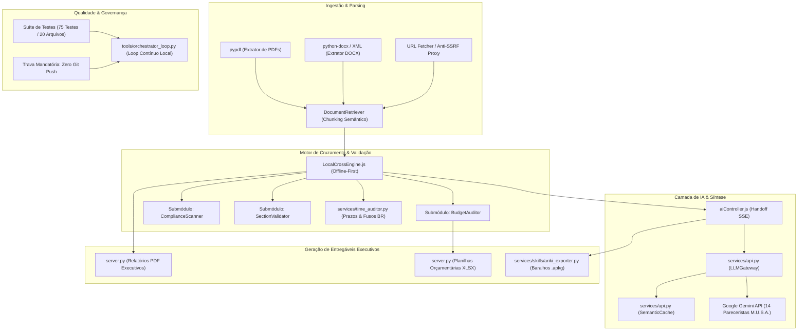

# DECOMPOSIÇÃO SISTÊMICA, DAGS DE DEPENDÊNCIA & TICKETS DE EXECUÇÃO

**Projeto:** EditalAudit AI  
**Data:** Setembro de 2026  
**Metodologia:** Graphify + Improve + Ponytail (YAGNI) + Gestão Ágil

---

## 1. Grafo de Dependências e Fluxo de Dados (Graphify DAG)

---

## 2. Diagnóstico Ponytail & Oportunidades Improve

### 2.1 Análise de Complexidade e Princípio YAGNI (Ponytail)
- **Zero Inchaço de Dependências:** O projeto utiliza bibliotecas padrão do Python sempre que viável (`urllib.request`, `http.server`, `re`, `json`, `hashlib`, `socket`). Não há necessidade de instalar frameworks pesados como FastAPI, Celery, LangChain ou Redis para a operação monoposto local.
- **Cache Semântico Nativo:** Em vez de depender de Redis ou Vector DB remoto, o cache semântico reside em memória com hash MD5 instantâneo e fallback BM25 in-process.
- **Eliminação de Código Morto:** As funções de rascunho órfãs foram eliminadas e o pipeline opera de forma enxuta.

---

## 3. Backlog de Tickets de Execução (TK-01 a TK-06)

| Ticket | Título | Responsável | Prioridade | Escopo |
| :---: | :--- | :---: | :---: | :--- |
| **TK-01** | **Refinamento Defensivo do `time_auditor.py`** | Subagente Backend | Alta | Suporte flexível a múltiplos formatos de data (ISO 8601, barras e hifens), validação de resolução de microssegundos e tolerância de rede. |
| **TK-02** | **Expansão Lexical de Compliance (Lei 14.133/2021) em `services/api.py`** | Subagente Backend / Governança | Alta | Inclusão de termos de impulso (ETP, matriz de risco, impugnação de edital, BDI, SICRO, SINAPI, cláusulas restritivas). |
| **TK-03** | **Implementação do Executor de Loop Contínuo (`tools/orchestrator_loop.py`)** | Subagente Backend / Qualidade | Crítica | Script autônomo para ciclo contínuo de verificação, teste, auditoria de segurança e registro de log sem git push. |
| **TK-04** | **Validação de Acessibilidade e Paridade de Esquema no Frontend** | Subagente Frontend | Média | Garantia de que todos os cards de auditoria exibem títulos corretos sem `undefined`, e validação de `aria-label`. |
| **TK-05** | **Execução da Suíte Completa de Testes Automatizados (Gauntlet 75/75)** | Subagente Qualidade (Gamma) | Crítica | Rodar e atestar que 100% dos testes unitários e de integração passam sem falhas. |
| **TK-06** | **Auditoria de Segurança Cibernética & Guardrail Git** | Subagente Qualidade (Gamma) | Crítica | Validar blindagem anti-SSRF, headers HTTP, limite de body e confirmação de zero alterações no Git remoto. |
