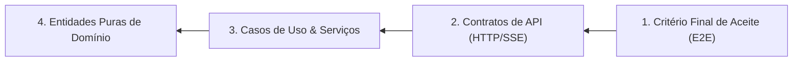

# DECOMPOSIÇÃO RETRÓGRADA (BACKWARDS DESIGN) & DISCIPLINA PONYTAIL (YAGNI)

**Projeto:** EditalAudit AI  
**Metodologia:** Backwards Design + Ponytail Senior Dev Filter  
**Data:** Setembro de 2026

---

## 1. Decomposição Retrógrada (Backwards Design)

O design retrógrado parte dos critérios de aceite finais da jornada do usuário no navegador e retrocede camada por camada até as entidades puras de domínio.

### 1.1 Critério Final de Aceite (Jornada Visual / E2E)
- **Cenário do Usuário:**
  1. O usuário abre `index.html` e arrasta o Edital (PDF ou DOCX) e a minuta de proposta.
  2. O sistema executa instantaneamente o **diagnóstico determinístico local (`LocalCrossEngine.js`)**, exibindo score geral (0-100), alertas vermelhos fiscais e validação de seções obrigatórias sem depender de internet.
  3. O usuário clica em "⚖️ Analisar Edital & Anexos". O streaming SSE do Gemini aciona a banca dos **14 Pareceristas M.U.S.A.**, enriquecendo os cards com citações do edital (`[📌 EDITAL: "..."]`), justificativas jurídicas e notas setoriais.
  4. O usuário clica em "Exportar Planilha Orçamentária" (`.xlsx` com fórmulas vivas) ou "Exportar Relatório Executivo" (`.pdf`).
  5. O usuário exporta o baralho Anki (`.apkg`) para estudar os pontos críticos de inabilitação.

### 1.2 Contratos de API Derivados Regressivamente
Para suportar o aceite final, o backend expõe contratos enxutos e estritos:
- `POST /api/analyze-edital-context`: Payload `{edital_text, doc_content}` $\rightarrow$ Stream SSE com eventos `chunk`, `agent_result` e `complete`.
- `POST /api/generate-audit-pdf`: Payload `{cover, criterios, summary}` $\rightarrow$ Retorna `application/pdf` gerado via ReportLab.
- `POST /api/export-finance-xlsx`: Payload `{budget_items, total_ceiling, admin_ceiling}` $\rightarrow$ Retorna `application/vnd.openxmlformats-officedocument.spreadsheetml.sheet` gerado via openpyxl com fórmulas `=SUM(...)`.
- `POST /api/export-anki`: Payload `{rules_list, edital_title}` $\rightarrow$ Retorna `application/octet-stream` (.apkg zipfile).
- `POST /api/fetch-url`: Payload `{url}` $\rightarrow$ Proxy seguro anti-SSRF para ingestão de editais online.

### 1.3 Casos de Uso & Serviços (Services)
- `DeadlineAuditorService` (`services/time_auditor.py`):
  - `parse_edital_deadline(date, time, tz)`
  - `is_submission_eligible(submission_dt, deadline_dt, grace_period=True)`
- `DocumentRetrieverService` (`services/api.py`):
  - `chunk_text(text, chunk_size, overlap)`
  - `retrieve(document_text, query_text, top_k)` com BM25 e compliance boosting.
- `AnkiExporterService` (`services/skills/anki_exporter.py`):
  - `create_anki_apkg_zip(cards, deck_name)`

### 1.4 Entidades Puras de Domínio
- **Edital:** Metadados (número, órgão concessor, objeto, modalidade), regras de teto orçamentário, prazos e marcos temporais com timezone.
- **Proposta:** Seções textuais estruturadas (justificativa, objetivos, metodologia, cronograma, ficha técnica, acessibilidade), planilha orçamentária de itens.
- **Parecer:** Identificador do avaliador (1 dos 14 M.U.S.A.), nota quantitativa, status (Conforme / Alerta / Inconforme), citação direta extraída do edital, recomendação técnica.
- **Matriz de Risco:** Probabilidade e impacto de inabilitação, cláusulas potencialmente restritivas da competitividade (Lei 14.133/2021).

---

## 2. Disciplina Ponytail (Filtro Anti-Overengineering & YAGNI)

| Risco de Sobre-engenharia | Decisão Ponytail (YAGNI) | Justificativa |
| :--- | :--- | :--- |
| **Criar microsserviços separados para cada um dos 14 agentes** | **REJEITADO.** Usar um único orquestrador com prompt estruturado e segmentação por ID de critério. | Elimina latência de IPC, necessidade de Docker/Kubernetes e complexidade de rede desnecessária. |
| **Adicionar Redis para cache semântico e sessões** | **REJEITADO.** Cache semântico implementado em memória Python (`services/api.py`) e sessões no IndexedDB do navegador. | Reduz dependências de infraestrutura a zero; o usuário roda a aplicação em qualquer máquina sem instalar serviços adicionais. |
| **Migrar para frameworks de orquestração de agentes pesados (LangChain/CrewAI)** | **REJEITADO.** O pipeline nativo com streaming SSE e parser de JSON embutido consome menos de 2% da memória e inicializa em 0.1s. | Dependências pesadas introduzem quebras de versão frequentes e atrasam o tempo de resposta. |
| **Substituir o motor de busca local por Elasticsearch/Milvus** | **REJEITADO.** BM25 implementado de forma pura em Python (`DocumentRetriever`) indexa editais de 200 páginas em menos de 100ms. | Desnecessário provisionar banco vetorial para documentos de um único edital por sessão. |
