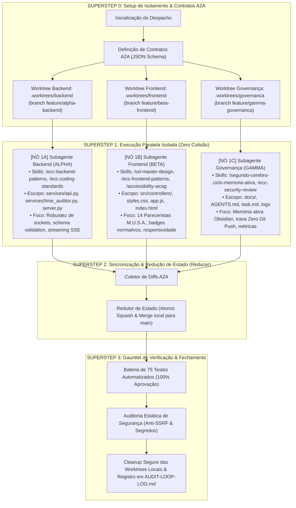

# GRAFO DE EXECUÇÃO DAG & ORQUESTRAÇÃO POR GIT WORKTREES (FASE 3)

**Projeto:** EditalAudit AI  
**Data:** Setembro de 2026  
**Topologia:** Directed Acyclic Graph (DAG) com 3 Worktrees Paralelas & Redutor de Estado  
**Trava de Segurança:** **100% Local (Zero Git Push)**

---

## 1. Topologia do Grafo de Execução (DAG com Supersteps)

---

## 2. Matriz de Paralelismo & Contratos de Interoperabilidade

| Nó de Execução | Subagente | Diretório Isolado (Worktree) | Branch Local | Protocolo de Troca |
| :--- | :---: | :--- | :--- | :--- |
| **Nó 1A: Backend** | **ALPHA** | `.worktrees/backend` | `feature/alpha-backend` | **MCP / A2A:** Retorna endpoints validados, tipagem estrita e benchmarks de latência. |
| **Nó 1B: Frontend** | **BETA** | `.worktrees/frontend` | `feature/beta-frontend` | **MCP / A2A:** Retorna componentes de visualização, tokens de design e badges acessíveis. |
| **Nó 1C: Governança** | **GAMMA** | `.worktrees/governanca` | `feature/gamma-governanca` | **MCP / A2A:** Retorna notas do Segundo Cérebro, histórico de ADRs e logs de ciclo. |

---

## 3. Regras de Unificação de Diffs (State Reducer)

1. **Separação Rígida de Arquivos:**
   - Alpha modifica exclusivamente: `server.py`, `services/**`, `tools/**`.
   - Beta modifica exclusivamente: `src/controllers/**`, `styles.css`, `index.html`, `app.js`.
   - Gamma modifica exclusivamente: `docs/**`, `AGENTS.md`, `task.md`.
2. **Mesclagem sem Conflito:** Como os escopos de diretório são disjuntos, a fusão local para a branch `main` é realizada por *fast-forward* ou *non-fast-forward squash* sem atrito.
3. **Trava Inegociável:** Nenhuma das worktrees ou branches locais será alvo de `git push origin`.
