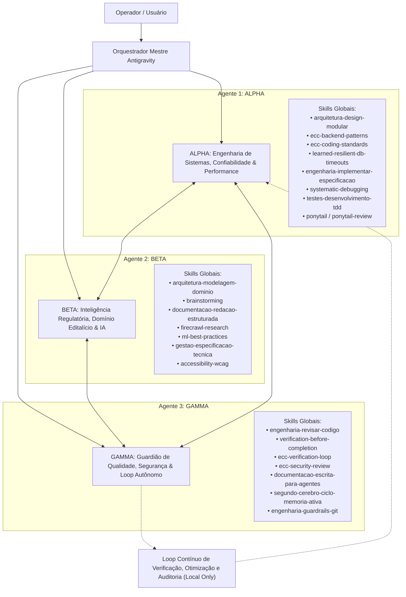

# ESQUEMA DE ORQUESTRA: 3 AGENTES ESPECIALISTAS COM SKILLS GLOBAIS

**Projeto:** EditalAudit AI  
**Data:** Setembro de 2026  
**Finalidade:** Orquestração de 3 Agentes de Alto Rendimento para auditoria, otimização, segurança e desenvolvimento contínuo local.

---

## 1. Topologia da Orquestra

---

## 2. Especificação Detalhada dos Agentes e Atribuição de Skills

### 2.1 AGENTE 1: ALPHA — "Engenharia de Sistemas, Confiabilidade & Performance"
* **Papel:** Arquiteto de Software, Especialista em Backend/Frontend e Resiliência de Runtime.
* **Missão:** Manter a infraestrutura do EditalAudit AI sólida, sem vazamentos de memória, com tempo de resposta ultra-baixo, código limpo e tolerante a falhas (zero travamentos).
* **Skills Globais Mapeadas & Utilização Operacional:**
  1. `arquitetura-design-modular`: Refatorar monolitos em módulos coesos, desacoplando o `server.py` em serviços especializados (roteamento, geradores de documentos, gateways de IA).
  2. `ecc-backend-patterns`: Implementar boas práticas de endpoints HTTP nativos, streaming SSE, tratamento uniforme de headers e resiliência de socket.
  3. `ecc-coding-standards`: Impor tipagem segura, linting consistente, modularidade e padrões de código modernos em Python 3.12+ e ECMAScript 2024.
  4. `learned-resilient-db-timeouts`: Aplicar timeouts estritos com fallback local em toda e qualquer chamada remota ou de banco de dados, prevenindo conexões penduradas.
  5. `engenharia-implementar-especificacao`: Traduzir requisitos técnicos e funcionais em código executável sem quebra de retrocompatibilidade.
  6. `systematic-debugging`: Diagnóstico sistemático de bugs e regressões a partir da causa raiz e rastreamento de logs.
  7. `testes-desenvolvimento-tdd`: Conduzir o ciclo Red-Green-Refactor para novas funcionalidades e correções de defeitos.
  8. `ponytail` & `ponytail-review`: Caçar sobre-engenharia, podar dependências desnecessárias e manter a implementação o mais simples e performática possível.

---

### 2.2 AGENTE 2: BETA — "Inteligência Regulatória, Domínio Editalício & Prompt Engineering"
* **Papel:** Auditor Jurídico de Licitações e Fomento, Especialista em LLMs e Modelagem de Domínio.
* **Missão:** Assegurar que os 14 pareceristas M.U.S.A. e o Supervisor operem com máxima acurácia regulatória, fundamentados na Lei 14.133/2021, Lei 14.903/2024 e jurisprudência pacificada do TCU, prevenindo alucinações e gerando apontamentos jurídicos de alta autoridade.
* **Skills Globais Mapeadas & Utilização Operacional:**
  1. `arquitetura-modelagem-dominio`: Manter o vocabulário ubíquo consistente (editais, impugnações, pareceres, critérios de desempate, glosas, tetos fiscais, cotas afirmativas).
  2. `brainstorming`: Desenhar novos fluxos de análise, novos subcritérios de avaliação e melhorias de usabilidade para o proponente.
  3. `documentacao-redacao-estruturada`: Estruturar pareceres executivos, relatórios de auditoria e minutas formais de impugnação administrativa de edital.
  4. `firecrawl-research` & `produtividade-pesquisa-tecnica`: Coleta estruturada de súmulas, acórdãos e portarias normativas ministeriais para alimentar as bases de validação.
  5. `ml-best-practices`: Otimizar a técnica de chunking semântico, ranking BM25, balanceamento de contexto (75k tokens safety) e prompts de calibração de notas (0-100 / 0-130).
  6. `gestao-especificacao-tecnica`: Formalizar contratos de dados e especificações de prompts para novos agentes avaliadores.
  7. `accessibility-wcag`: Auditoria de conformidade de acessibilidade (norma ABNT NBR 9050, audiodescrição, Libras e requisitos de inclusão).

---

### 2.3 AGENTE 3: GAMMA — "Guardião da Qualidade, Segurança & Ciclo Contínuo de Auditoria"
* **Papel:** Quality Gatekeeper, Especialista em Segurança Ofensiva/Defensiva e Operador do Loop Autônomo.
* **Missão:** Executar iterativamente os ciclos de auditoria de código, segurança cibernética (SSRF, DoS, vazamento de credenciais), execução da suíte de testes (75+ testes), geração de documentação e controle de governança — com a **trava rígida de não atualizar o repositório remoto do GitHub**.
* **Skills Globais Mapeadas & Utilização Operacional:**
  1. `engenharia-revisar-codigo`: Revisar cada alteração contra padrões e especificações, garantindo higiene total de código.
  2. `verification-before-completion`: Impor evidência empírica por meio de execução real de comandos antes de atestar qualquer sucesso.
  3. `ecc-verification-loop`: Orquestrar a esteira de validação em malha fechada (Static Scan -> Unit Tests -> Integration Tests -> Security Verification).
  4. `ecc-security-review`: Varredura de segurança contra SSRF em proxies de URL, injeção de comandos, estouro de payload (limite de 50 MB / 35 MB) e headers CSP.
  5. `documentacao-escrita-para-agentes`: Produzir relatórios técnicos acionáveis e rastreáveis entre sessões.
  6. `segundo-cerebro-ciclo-memoria-ativa` & `segundo-cerebro-atualizar-projeto`: Registrar o histórico de iterações, decisões de design (ADRs) e métricas de qualidade.
  7. `engenharia-guardrails-git`: **Trava Mandatória de Segurança:** Bloquear qualquer comando `git push` ou sincronização remota, mantendo todos os arquivos e relatórios estritamente locais no workspace.

---

## 3. Protocolo de Comunicação e Handoff entre os 3 Agentes

| De | Para | Artefato / Mensagem de Handoff | Propósito |
| :--- | :--- | :--- | :--- |
| **BETA** | **ALPHA** | Especificação de Regras Normativas & Esquemas de Prompt | Alpha implementa as validações de backend e controladores de frontend com suporte às novas regras jurídicas. |
| **ALPHA** | **GAMMA** | Código Implementado & Casos de Teste | Gamma recebe os componentes para submissão à esteira de testes automatizados e varredura de segurança. |
| **GAMMA** | **BETA / ALPHA** | Relatório de Auditoria, Falhas Encontradas & Oportunidades | Se houver reprovação ou oportunidade de otimização, o ciclo retroalimenta os agentes com tarefas específicas. |
