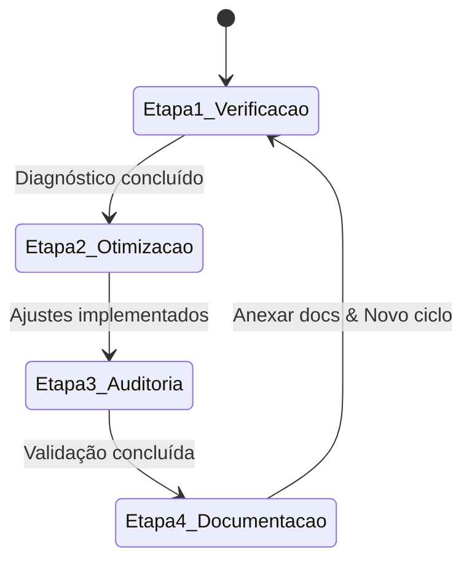

# PROTOCOLO DE EXECUÇÃO: SISTEMA DE LOOP CONTÍNUO DE AUDITORIA & OTIMIZAÇÃO

**Projeto:** EditalAudit AI  
**Data:** Setembro de 2026  
**Diretiva Especial:** Execução autônoma contínua em loop local.  
**Regra de Ouro:** **NÃO ATUALIZAR O DIRETÓRIO DO GITHUB (ZERO GIT PUSH). MANTER TODAS AS OPERAÇÕES, DOCUMENTOS E LOGS NO AMBIENTE LOCAL.**

---

## 1. Estrutura do Ciclo em 4 Etapas (Loop Iterativo)

O loop contínuo é composto por quatro etapas que se repetem sequencialmente:

### Etapa 1: Verificação (Verification Phase) — *Agente Gamma & Alpha*
1. **Execução da Suíte de Testes Automatizados:**
   - Comando padrão: `.\.venv\Scripts\python.exe -m unittest discover tests`
   - Monitoramento de 75+ testes e 20 arquivos.
   - Detecção de falhas, exceções, lentidão e asserções quebradas.
2. **Inspeção de Saúde dos Endpoints & Roteamento:**
   - Teste de importação e verificação estática de `server.py`, `services/api.py`, `services/time_auditor.py`.
   - Checagem da integridade de sintaxe do JavaScript (`app.js`, controladores em `src/controllers/`).
3. **Checagem de Guardrails de Git:**
   - Conferência de `git status` para garantir que o workspace permanece limpo e que nenhum comando destrutivo ou `push` foi agendado.

---

### Etapa 2: Otimização (Optimization Phase) — *Agente Alpha & Beta*
1. **Otimização de Desempenho e Memória:**
   - Redução de redundâncias e simplificação YAGNI (`ponytail`).
   - Melhorias no LRU Cache do `DocumentRetriever` em `services/api.py`.
   - Ajustes de tolerância e tratamento de timezone em `services/time_auditor.py`.
2. **Refinamento de Modelagem de Domínio & Prompts:**
   - Enriquecimento dos dicionários de regras fiscais e limites orçamentários.
   - Calibração de detecção de cláusulas restritivas de licitações (Lei 14.133/2021).
   - Otimização do gerador de consultas web em `webSearchController.js`.
3. **Robustez de Entrada e Tratamento de Exceções:**
   - Prevenção de divisão por zero ou tipos incompatíveis na geração de planilhas Excel (`openpyxl`) e PDFs (`reportlab`).

---

### Etapa 3: Auditoria (Audit Phase) — *Agente Gamma*
1. **Auditoria de Segurança Cibernética:**
   - Validação dos filtros Anti-SSRF (`validate_safe_url`).
   - Verificação dos limites de payload (50 MB no backend, 35 MB no frontend).
   - Validação dos headers HTTP estritos (`nosniff`, `DENY`, `strict-origin-when-cross-origin`, CSP restrito).
2. **Auditoria de Código Morto e Vazamento de Segredos:**
   - Busca de funções e variáveis órfãs.
   - Verificação de que nenhum token, chave de API ou credencial está exposto no código ou histórico.
3. **Auditoria de Paridade e Consistência de Dados:**
   - Verificação da sincronização entre o motor offline (`LocalCrossEngine`) e o motor online (`aiController`).

---

### Etapa 4: Documentação e Registro (Documentation & Memory Phase) — *Agente Gamma & Beta*
1. **Geração e Atualização de Documentos:**
   - Anexar relatórios de auditoria incremental no diretório `docs/`.
   - Atualizar a matriz de conformidade e o histórico de execuções.
2. **Registro de Estado na Memória Ativa:**
   - Consolidação dos deltas de melhoria, métricas de execução e pontos de atenção.
3. **Reinício do Ciclo:**
   - Preparação para a próxima iteração do loop, garantindo estabilidade e persistência local contínua.
