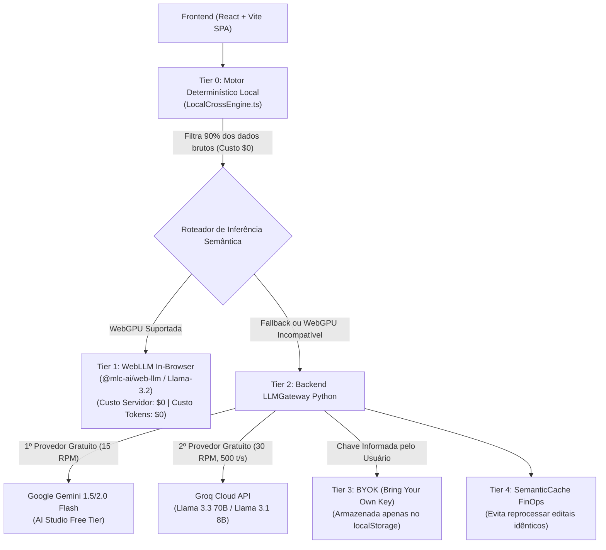

# Especificação de Design Arquitetural: EditalAudit AI v3 (Online & Custo Zero)

**Data:** 2026-09-12  
**Status:** Aprovado em Sabatina (grill-me + gestao-questionario-requisitos)  
**Classificação:** Architectural  
**Padrão de Governança:** Agentes Alpha, Beta e Gamma | Padrão Ponytail (Stdlib) + Padrão Matt Pocock (TypeScript)

---

## 1. Visão Geral e Motivação

O **EditalAudit AI** evolui de uma aplicação local monolítica para uma arquitetura híbrida moderna capaz de rodar em **servidores online com custo zero de infraestrutura ($0/mês)** e **independência de um único provedor de IA**, resolvendo a limitação de que regras puramente determinísticas (offline sem LLM) não possuem a profundidade semântica necessária para auditar projetos e editais públicos com autoridade técnica e jurídica.

---

## 2. Decisões Estratégicas Fechadas na Sabatina

| Dimensão | Decisão Aprovada | Justificativa Técnica |
| :--- | :--- | :--- |
| **Backend** | Modularização Nativa Stdlib (`services/backend/`) | Respeito estrito ao Padrão Ponytail (zero dependências pesadas), mantendo tempo de boot instantâneo e 80/80 testes verdes. |
| **Frontend** | React + Vite + TypeScript (`web/`) | Componentização moderna, tipagem estrita (Matt Pocock), hooks de streaming SSE reativo e empacotamento estático para CDNs gratuitas. |
| **Inteligência** | Motor Híbrido Multi-Provider + RAG Local + Anki | RAG vetorial/BM25 local das Leis 14.133 e 14.903, streaming simultâneo dos 14 pareceristas MUSA e exportação APKG de riscos. |
| **Hospedagem** | Frontend (Vercel/Cloudflare Pages) + Backend (Hugging Face Spaces / Render) | Infraestrutura perpétua gratuita, CDN global, SSL automático e 16 GB de RAM disponível no HF Spaces. |
| **IA Resiliente** | Multi-Tier Gateway (Gemini Free + Groq Free + WebLLM WebGPU + BYOK) | Eliminação de dependência única; tier gratuito do Gemini/Groq + WebGPU no cliente para custo $0 de tokens no servidor. |
| **Persistência** | Local-First (IndexedDB) + Nuvem Opcional (Supabase Free) | 100% aderente à LGPD (dados de editais/orçamentos não vazam para o servidor) com custo de banco = $0. |

---

## 3. Arquitetura em Camadas de IA (Anti-Dependência & FinOps)

Para não depender exclusivamente de uma API paga ou de um único provedor com rate limit:

---

## 4. Topologia de Implantação Online com Custo Zero ($0/mês)

1. **Camada Estática / Frontend:**
   - Compilado via Vite (`npm run build`) gerando pasta `dist/`.
   - Deploy automático via GitHub / Git local para **Cloudflare Pages** ou **Vercel** (Bandwidth ilimitada, 100% grátis).
2. **Camada de Computação / Backend Python:**
   - Implantação via Docker ou Python nativo no **Hugging Face Spaces** (2 vCPU, 16 GB RAM gratuitas) ou **Render Web Service Free**.
   - Atua de forma stateless, recebendo requisições da SPA e intermediando downloads protegidos de editais (anti-SSRF), PDFs ReportLab e chamadas às APIs de IA.
3. **Camada de Dados & Segurança (LGPD):**
   - Todos os projetos, orçamentos, rascunhos e documentos ficam salvos no **IndexedDB** do navegador do proponente (`auditorDB.ts`).
   - Nenhum dado confidencial do proponente é armazenado permanentemente no servidor.

---

## 5. Próximos Passos (Plano de Execução)

A execução seguirá a estratégia **Strangler Fig (Migração Incremental)** em 4 fases:
- **Fase 1:** Modularização do Backend Python (`services/backend/`) garantindo 80/80 testes aprovados.
- **Fase 2:** Implementação do `LLMGateway` Multi-Provider com fallback Gemini Free + Groq Free + BYOK + Semantic Cache.
- **Fase 3:** Criação da aplicação React + Vite + TypeScript em `web/`, migrando os motores locais com tipagem estrita.
- **Fase 4:** Registro no Obsidian Vault (`vault/`), testes E2E e instruções de deploy gratuito.
