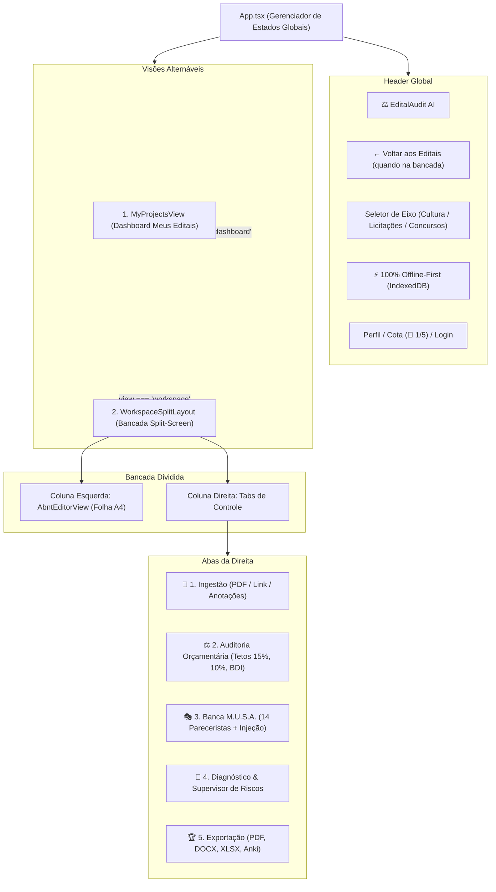

# Especificação de Design: Bancada de Trabalho Split-Screen & Navegação do Portal (Passo 1)

**Data:** 2026-09-12  
**Status:** Aprovado pelo Usuário (Abordagem 1 — Split-Screen Workspace)  
**Classificação:** Architectural  
**Padrão de Governança:** Agentes Alpha, Beta e Gamma | Padrão Ponytail (Stdlib) + Padrão Matt Pocock (TypeScript)

---

## 1. Visão Geral e Objetivo

Esta especificação define a reconstrução da experiência de uso (UX) e arquitetura do **EditalAudit AI v3**, resgatando o coração do produto original:
1. **Painel Inicial ("Meus Editais"):** Dashboard com gestão de cotas (5 editais / 30 MB por usuário), lista de projetos e botão "+ Novo Edital".
2. **Bancada de Trabalho Split-Screen (Duas Colunas):**
   - **Coluna Esquerda:** O documento oficial da proposta em folha A4 viva, com capa ABNT, seções numeradas de 1 a 14 e pontuação em tempo real.
   - **Coluna Direita:** O copiloto de inteligência com 5 abas integradas (Ingestão do Edital, Auditoria Matemática, Banca dos 14 Pareceristas M.U.S.A., Supervisor de Riscos e Exportação Multi-Formato).

---

## 2. Arquitetura de Navegação e Estados do Portal

---

## 3. Especificação Detalhada dos Componentes

### 3.1 `AbntEditorView.tsx` (Coluna Esquerda — A Folha A4)
- **Barra de Ferramentas:**
  - Formatação tipográfica: Fonte (Arial / Times New Roman), Negrito, Itálico, Sublinhado, Alinhamentos (Esquerda, Centro, Justificado).
  - Ações rápidas: Inserir Linha Orçamentária, Botão *"🪄 Formatar ABNT com IA"*, Salvar Rascunho.
  - Indicador de Conformidade no topo da folha: `Score: 85% (Excelente)`.
- **Capa ABNT Editável:**
  - Instituição de Fomento
  - Nome do Proponente
  - Título do Projeto
  - Cidade - UF / Ano
- **As 14 Seções Oficiais Editáveis:**
  1. Justificativa e Relevância
  2. Objetivos (Geral e Específicos)
  3. Metodologia e Plano de Trabalho
  4. Cronograma Físico de Atividades
  5. Orçamento e Planilha de Custos (Tabela dinâmica com somatório automático)
  6. Acessibilidade e Cotas
  7. Público-Alvo e Beneficiários
  8. Contrapartida Social e Legado
  9. Plano de Comunicação e Divulgação
  10. Ficha Técnica e Equipe
  11. Monitoramento, Avaliação e Indicadores
  12. Compliance e Marcos Legais
  13. Sustentabilidade e Mitigação Ambiental
  14. Rider Técnico e Necessidades Logísticas

### 3.2 `IngestionView.tsx` (Aba 1 da Direita)
- Zona de arrastar e soltar (Drag & Drop) para o PDF do Edital de Convocação.
- Entrada de link web de edital com busca via backend `/api/fetch-url`.
- Caixa de texto para colar o conteúdo do edital.
- Arraste de rascunho de proposta para autopreenchimento da folha A4.
- Caixa de anotações e direcionamentos específicos do proponente para os pareceristas.

### 3.3 Integração da Banca MUSA com o Editor
- Quando o usuário visualizar o parecer de um dos 14 especialistas (ex: parecerista de Acessibilidade recomendando incluir Libras e Audiodescrição):
  - Um botão de ação direta **"✨ Inserir no Editor"** injetará o texto sugerido exatamente na Seção 6 (Acessibilidade) da folha A4, atualizando a pontuação imediatamente.

---

## 4. Plano de Verificação e Qualidade

1. **Compilação e Tipagem Estrita:**
   - `npm run build` na pasta `web/` com **0 erros de tipagem TypeScript**.
2. **Suíte de Testes Automatizados:**
   - Todos os **97/97 testes** do backend Python devem continuar passando com 100% de sucesso (`npm run test`).
3. **Resiliência Offline:**
   - O editor e a auditoria matemática devem funcionar perfeitamente sem internet ou se o Supabase estiver desconectado.
