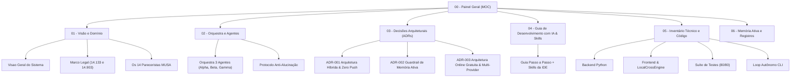

# 🏛️ EditalAudit AI — Painel Geral do Projeto (MOC)

> [!important] **PONTO DE ANCORAGEM OBRIGATÓRIO (ANTI-ALUCINAÇÃO)**
> Todo agente de IA antes de realizar qualquer alteração, responder dúvidas conceituais ou propor arquitetura DEVE consultar este cofre (`vault/`). Toda afirmação técnica deve ser fundamentada nos dados reais registrados aqui e no código local.
> 🔗 Consulte: [[02 - Orquestra e Agentes/Protocolo Mandatorio de Memoria e Anti-Alucinacao|Protocolo Mandatório de Memória]]

---

## 🧭 Mapa de Navegação do Segundo Cérebro

---

## 📊 Status Operacional e Métricas do Sistema

| Métrica / Dimensão | Estado Atual | Meta / Requisito | Status |
| :--- | :--- | :--- | :---: |
| **Suíte de Testes Automatizados** | 131 testes em 29 arquivos | 100% de aprovação (131/131) | ✅ Aprovado |
| **Guardrail de Segurança Git** | Zero Git Push (Local-first) | 0 commits remotos não autorizados | 🛡️ Blindado |
| **Motor de Cálculo Local** | `LocalCrossEngine.js` | Determinístico, sem alucinação matemática | ⚡ 100% Offline |
| **Resiliência de Backend** | `learned-resilient-db-timeouts` | Fallback atômico local + timeout estrito | 🟢 Ativo |
| **Padrão Matt Pocock de Tipos** | JSDoc estrito + Python Type Hints | Proibição de asserções cegas (`as any`) | 💎 Padronizado |
| **Memória Persistente do Agente** | Obsidian Vault (`vault/`) | Check-in mandatório pré-execução | 🧠 Ativo |

---

## 📁 Estrutura das Seções do Cofre

### 1. [[01 - Visão e Domínio/Visao Geral do Sistema|01 - Visão Geral do Sistema]]
- Entenda a proposta de valor, público-alvo, fluxo de auditoria cruzada (Cross-Audit) e limites de responsabilidade técnica.
- [[01 - Visão e Domínio/Marco Legal e Dominio Regulatorio|Marco Legal das Compras Públicas e Cultura]] (Lei 14.133/2021, Lei 14.903/2024, Súmulas 263 e 272 do TCU).
- [[01 - Visão e Domínio/Os 14 Pareceristas MUSA|Os 14 Pareceristas M.U.S.A.]] (Perfis, prompts normativos e matriz de validação).
- [[01 - Visão e Domínio/Arquitetura Hibrida Offline-First|Arquitetura Híbrida Offline-First]] (Cálculo matemático determinístico local + IA semântica).

### 2. [[02 - Orquestra e Agentes/Orquestra de 3 Agentes (Alpha, Beta, Gamma)|02 - Orquestra e Agentes]]
- Distribuição dos agentes especializados:
  - **Alpha:** Engenharia de Sistemas, Confiabilidade & Performance.
  - **Beta:** Domínio Regulatória, Direito Público & RAG Semântico.
  - **Gamma:** Guardião da Qualidade, Auditoria de Segurança & Loop Autônomo.
- [[02 - Orquestra e Agentes/Protocolo Mandatorio de Memoria e Anti-Alucinacao|Protocolo Mandatório de Memória e Anti-Alucinação]] (O ponto de entrada antes de qualquer ação).

### 3. [[03 - Decisões Arquiteturais (ADRs)/ADR-001 - Arquitetura Hibrida e Zero Git Push|03 - Decisões Arquiteturais (ADRs)]]
- [[03 - Decisões Arquiteturais (ADRs)/ADR-001 - Arquitetura Hibrida e Zero Git Push|ADR-001: Arquitetura Híbrida Offline-First e Zero Git Push]]
- [[03 - Decisões Arquiteturais (ADRs)/ADR-002 - Guardrail de Memoria Ativa no Vault|ADR-002: Guardrail Mandatório de Memória Ativa no Obsidian Vault]]
- [[03 - Decisões Arquiteturais (ADRs)/ADR-003 - Arquitetura Online Gratuita e Multi-Provider LLM|ADR-003: Arquitetura Online Gratuita, Frontend React+Vite e Multi-Provider LLM]]
- [[03 - Decisões Arquiteturais (ADRs)/ADR-004 - Modelagem de Dominio Ubiquo e Fatiamento em Tickets DAG|ADR-004: Modelagem de Domínio Ubíquo (DDD), Filtro Ponytail e Fatiamento em Tickets DAG]]

### 4. [[04 - Guia de Desenvolvimento com IA & Skills/Guia Integrado de Desenvolvimento com IA e Skills|04 - Guia de Desenvolvimento com IA & Skills (Seção Especial)]]
- **O fluxo de trabalho passo a passo unificado com as 130+ skills da IDE:**
  - *Fase 1:* Concepção, Sabatina & Ideação.
  - *Fase 2:* Arquitetura, Modelagem & Fatiamento em Tickets.
  - *Fase 3:* Execução TDD, Backend, Frontend e Big Data.
  - *Fase 4:* O Gauntlet: Auditoria, Segurança e Verificação.
  - *Fase 5:* Handoff, Limpeza de IA e Memória no Vault.

### 5. [[05 - Inventário Técnico e Código/Backend e Servicos Python|05 - Inventário Técnico e Código]]
- [[05 - Inventário Técnico e Código/Backend e Servicos Python|Backend e Serviços Python]] (`server.py`, `services/`).
- [[05 - Inventário Técnico e Código/Frontend e LocalCrossEngine JS|Frontend e LocalCrossEngine JS]] (`app.js`, `src/controllers/`, `styles.css`).
- [[05 - Inventário Técnico e Código/Suite de Testes e Metricas de Confiabilidade|Suíte de Testes (76 testes aprovados)]] (`tests/`).
- [[05 - Inventário Técnico e Código/Loop Autonomo e Ferramentas CLI|Ferramentas CLI e Loop Autônomo]] (`tools/orchestrator_loop.py`).

### 6. [[06 - Memória Ativa e Registros/Diario de Bordo e Aprendizados|06 - Memória Ativa e Registros]]
- [[06 - Memória Ativa e Registros/Diario de Bordo e Aprendizados|Diário de Bordo e Aprendizados Contínuos]]
- [[06 - Memória Ativa e Registros/Proximos Passos e Roadmap do Projeto|Próximos Passos e Roadmap Técnico (Foco Backend & Domínio)]]
- [[06 - Memória Ativa e Registros/Livro-Razao de Debitos Tecnicos (Ponytail)|Livro-Razão de Débitos Técnicos (Ponytail)]]

