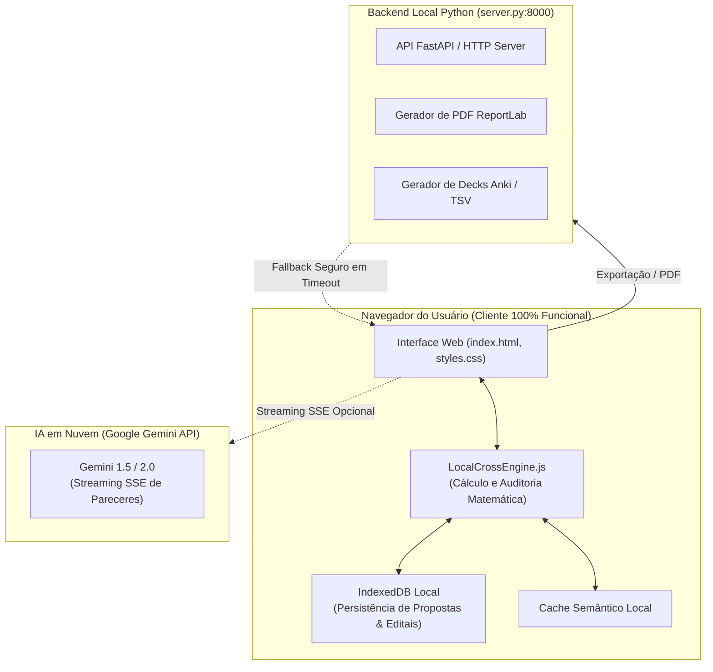

# ⚡ Arquitetura Híbrida Offline-First

> O princípio nuclear de engenharia do **EditalAudit AI** é a **Resiliência Offline-First**: o usuário nunca fica na mão se a internet cair, e a matemática orçamentária nunca é confiada a um modelo generativo probabilístico.

---

## 🏗️ Separação de Responsabilidades

---

## 🔒 Os 3 Pilares da Arquitetura Híbrida

### 1. Determinismo Matemático (`LocalCrossEngine.js`)
- Cálculos orçamentários (multiplicações de quantidade por valor unitário, somatórios parciais, tetos percentuais de 15% e 10%) rodam em JavaScript puro no navegador.
- Complexidade algorítmica $O(1)$ para conferências unitárias e $O(n)$ para planilhas completas.
- Zero latência de rede e **zero alucinação aritmética**.

### 2. Persistência Desconectada (IndexedDB)
- Todas as propostas, editais importados, planilhas e históricos de análises são gravados no banco local do navegador (`IndexedDB`).
- O operador pode auditar propostas no avião, no campo ou em repartições públicas sem conexão à internet.

### 3. Desacoplamento da IA em Nuvem com Fallbacks
- Quando há conexão e chave de API do Gemini configurada, o sistema ativa o streaming de pareceres dos 14 pareceristas M.U.S.A. via Server-Sent Events (SSE).
- Se a API cair ou demorar mais de 10 segundos, o backend e o frontend ativam o padrão `learned-resilient-db-timeouts`: a tela **não trava**, exibindo a auditoria local completa com um alerta discreto de que os pareceres semânticos estão em modo de espera.

---

## 🔗 Links Relacionados
- [[03 - Decisões Arquiteturais (ADRs)/ADR-001 - Arquitetura Hibrida e Zero Git Push|ADR-001: Arquitetura Híbrida e Zero Git Push]]
- [[05 - Inventário Técnico e Código/Frontend e LocalCrossEngine JS|LocalCrossEngine.js]]
- [[00 - Dashboard/00 - Painel Geral do Projeto EditalAudit|Painel Geral (MOC)]]
