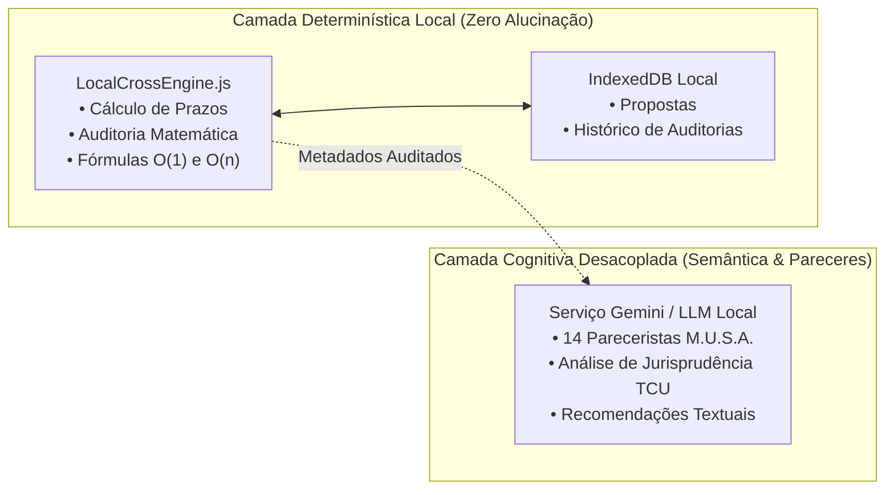

# 🌐 Visão Geral do Sistema: EditalAudit AI

> **EditalAudit AI** é uma plataforma jurídica e operacional avançada (LegalTech) especializada em **auditoria de conformidade regulatória**, **análise de risco de desclassificação** e **otimização orçamentária** para propostas em licitações públicas e editais culturais no Brasil.

---

## 🎯 Problema que o Sistema Resolve

No ecossistema de compras públicas e fomento cultural brasileiro:
1. **Prazos e Erros Formais:** Mais de 40% das propostas são desclassificadas por falhas aritméticas em planilhas orçamentárias ou contagem incorreta de prazos processuais (dias úteis vs dias corridos).
2. **Incerteza Jurídica:** A transição da antiga Lei 8.666/93 para a **Nova Lei de Licitações (Lei 14.133/2021)** e o novo **Marco Legal da Cultura (Lei 14.903/2024)** criaram exigências rígidas que proponentes e órgãos públicos frequentemente descumprem.
3. **Alucinação de Modelos de IA Tradicionais:** Utilizar LLMs genéricas para calcular orçamentos ou auditar editais resulta em "alucinações aritméticas" graves, onde a IA afirma que uma soma está correta quando na verdade há centavos de divergência.

---

## ⚡ A Solução EditalAudit AI: Motor Híbrido

O EditalAudit resolve esses problemas dividindo as responsabilidades de forma estrita:

1. **Auditoria Matemática & Temporal Local (`LocalCrossEngine.js`):**
   - 100% determinístico, roda no navegador ou no backend sem depender de IA generativa.
   - Aplica as regras da Lei 14.133 (exclusão do dia do começo, inclusão do vencimento, prorrogação para o primeiro dia útil).
   - Valida cada linha do orçamento, quantitativos, valores unitários e subtotais.

2. **Auditoria Semântica & Pareceres Cognitivos (Framework M.U.S.A.):**
   - Uma banca multidisciplinar de **14 Pareceristas Virtuais** avalia a proposta sob diferentes ângulos (acessibilidade, impacto cultural, economicidade, sustentabilidade, segurança jurídica).
   - RAG Semântico ancorado nas súmulas do TCU (especialmente Súmulas 263 e 272).

---

## 👥 Perfis de Usuários Atendidos

1. **Proponentes Culturais & Artistas:** Editais da PNAB, Lei Paulo Gustavo, Lei Aldir Blanc e Rouanet/Salic.
2. **Licitantes e Fornecedores Públicos:** Empresas que disputam pregões eletrônicos, concorrências e dispensas pela Lei 14.133/2021.
3. **Pareceristas & Comissões de Licitação:** Órgãos públicos que precisam auditar lotes massivos de propostas com transparência e velocidade.

---

## 🔗 Links Relacionados
- [[01 - Visão e Domínio/Marco Legal e Dominio Regulatorio|Marco Legal e Normas Regulatórias]]
- [[01 - Visão e Domínio/Os 14 Pareceristas MUSA|Os 14 Pareceristas M.U.S.A.]]
- [[01 - Visão e Domínio/Arquitetura Hibrida Offline-First|Arquitetura Híbrida Offline-First]]
- [[00 - Dashboard/00 - Painel Geral do Projeto EditalAudit|Painel Geral (MOC)]]
