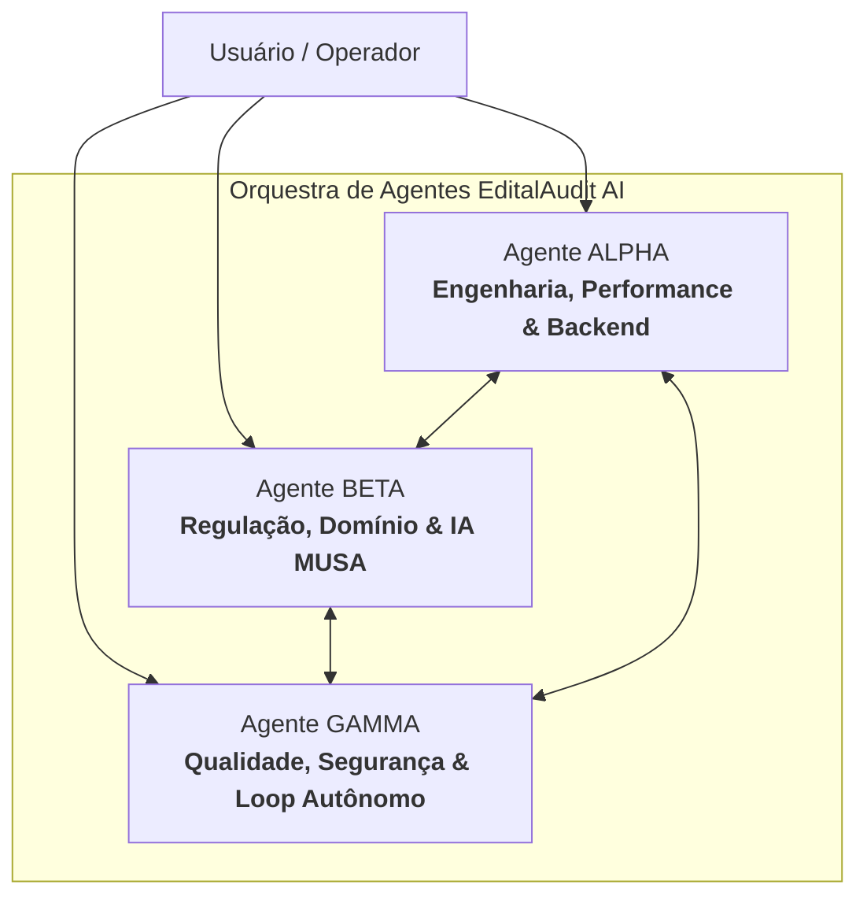

# 👥 A Orquestra de 3 Agentes Especialistas

> Para garantir velocidade, profundidade e zero conflito de papéis, o repositório opera sob uma divisão tripartite inspirada nos princípios da engenharia militar e governança de software crítico.

---

## 🏛️ A Divisão de Papéis e Habilidades

---

### 1. Agente ALPHA: Engenharia de Sistemas, Confiabilidade & Performance
- **Missão:** Manter a robustez das fundações de código, latência ultrabaixa, estabilidade de sockets e contratos de tipo rigorosos.
- **Áreas de Atuação:**
  - Servidor backend em Python (`server.py`, `services/`).
  - Resiliência de chamadas remotas e controle de timeouts (`learned-resilient-db-timeouts`).
  - Tipagem estrita com Python Type Hints e JSDoc no frontend (Padrão Matt Pocock).
  - Filosofia de código enxuto (`ponytail` / YAGNI).
- **Skills Atribuídas:**
  - `arquitetura-design-modular`
  - `ecc-backend-patterns`
  - `ecc-coding-standards`
  - `learned-resilient-db-timeouts`
  - `engenharia-implementar-especificacao`
  - `systematic-debugging`
  - `testes-desenvolvimento-tdd`
  - `ponytail` / `ponytail-review`

---

### 2. Agente BETA: Inteligência Regulatória, Domínio Editalício & IA
- **Missão:** Garantir autoridade jurídica e fidelidade legal aos apontamentos do sistema, orquestrando os 14 pareceristas M.U.S.A.
- **Áreas de Atuação:**
  - Aplicação prática da Lei 14.133/2021 e Lei 14.903/2024.
  - Jurisprudência consolidada do TCU (Súmulas 263 e 272).
  - Engenharia de prompts e streaming Server-Sent Events (`src/controllers/aiController.js`).
  - Acessibilidade visual e comunicacional da interface (WCAG 2.1 AA).
- **Skills Atribuídas:**
  - `arquitetura-modelagem-dominio`
  - `brainstorming`
  - `documentacao-redacao-estruturada`
  - `firecrawl-research` / `produtividade-pesquisa-tecnica`
  - `ml-best-practices`
  - `gestao-especificacao-tecnica`
  - `accessibility-wcag`

---

### 3. Agente GAMMA: Guardião da Qualidade, Segurança & Loop Autônomo
- **Missão:** Assegurar que nada quebrado entre na base, mantendo 100% de testes aprovados, bloqueio estrito de Git e memória viva no Obsidian.
- **Áreas de Atuação:**
  - Esteira contínua de verificação (76/76 testes aprovados).
  - Varredura estática de segurança (anti-SSRF, prevenção de vazamento de segredos).
  - Trava inegociável de **Zero Git Push** (segurança local-first).
  - Execução do loop autônomo de auditoria (`tools/orchestrator_loop.py`).
  - Atualização do Segundo Cérebro no Obsidian (`vault/`).
- **Skills Atribuídas:**
  - `engenharia-revisar-codigo`
  - `verification-before-completion`
  - `ecc-verification-loop`
  - `ecc-security-review`
  - `documentacao-escrita-para-agentes`
  - `segundo-cerebro-ciclo-memoria-ativa`
  - `engenharia-guardrails-git`

---

## 🔗 Links Relacionados
- [[02 - Orquestra e Agentes/Protocolo Mandatorio de Memoria e Anti-Alucinacao|Protocolo Mandatório de Memória]]
- [[04 - Guia de Desenvolvimento com IA & Skills/Guia Integrado de Desenvolvimento com IA e Skills|Guia Integrado de Skills]]
- [[00 - Dashboard/00 - Painel Geral do Projeto EditalAudit|Painel Geral (MOC)]]
