# 🛡️ Protocolo Mandatório de Memória e Anti-Alucinação

> [!danger] **REGRA SAGRADA DO AGENTE: NÃO AÇÃO SEM CONSULTA PRÉVIA**
> Nenhuma IA ou agente pode modificar arquivos de código, alterar dependências ou propor diagnósticos arquiteturais sem antes **consultar a memória viva deste Vault** (`vault/`).

---

## 🎯 Por que este Protocolo Existe?

Modelos de linguagem (LLMs), por mais inteligentes que sejam, sofrem de duas falhas críticas se não forem ancorados:
1. **Alucinação:** Inventar caminhos de arquivos que não existem, criar métodos inexistentes ou esquecer restrições decididas anteriormente.
2. **Prolixidade Desconecta:** Dar respostas genéricas e teóricas em vez de inspecionar a realidade objetiva do projeto.

Este protocolo força a IA a agir como um **engenheiro experiente e ancorado na realidade**: checa o cofre, afere o código real, executa com o mínimo de passos e registra o aprendizado no final.

---

## 🔄 O Ciclo Mandatório de 3 Etapas: Check-in, Execução e Check-out

```mermaid
sequenceDiagram
    participant User as Usuário
    participant Agent as Agente IA
    participant Vault as Obsidian Vault (vault/)
    participant Code as Base de Código Real
    participant Tests as Suíte de Testes (76)

    User->>Agent: Solicitação / Comando
    rect rgb(20, 30, 50)
        Note over Agent,Vault: ETAPA 1: CHECK-IN MANDATÓRIO
        Agent->>Vault: Lê Painel Geral & Notas Relacionadas
        Agent->>Code: Inspeciona arquivos reais afetados (Grounding)
    end
    rect rgb(30, 45, 30)
        Note over Agent,Code: ETAPA 2: EXECUÇÃO OBJETIVA & TDD
        Agent->>Tests: Roda testes antes / implementa via TDD
        Agent->>Code: Aplica alteração cirúrgica (Ponytail YAGNI)
        Agent->>Tests: Valida suíte completa (100% aprovação)
    end
    rect rgb(45, 30, 20)
        Note over Agent,Vault: ETAPA 3: CHECK-OUT & MEMÓRIA
        Agent->>Vault: Registra decisão/aprendizado na nota de Memória
        Agent->>User: Resposta concisa com links de arquivos reais
    end
```

---

## 📋 Regras Estritas de Ancoragem (Grounding)

### 1. Proibição de Suposições Cegas
- **Regra:** Nunca assuma que uma biblioteca está instalada ou que um arquivo existe. Use ferramentas de busca ou visualização (`view_file`, `list_dir`, `grep_search`).
- **Padrão:** Sempre mencione o caminho de arquivo completo como link clicável (ex: `[server.py](file:///c:/Users/victo/.gemini/antigravity-ide/scratch/edital-audit/server.py)`).

### 2. Proibição de Quebra do Motor Local
- **Regra:** A matemática de orçamentos e prazos **NUNCA** pode ser delegada exclusivamente para um prompt de LLM. Os cálculos devem passar pelo `LocalCrossEngine.js` e pelas fórmulas determinísticas do backend.
- **Motivo:** IAs cometem erros aritméticos sutis; a auditoria de recursos públicos não tolera discrepâncias de 1 centavo.

### 3. A Trava Inegociável de Zero Git Push
- **Regra:** Sob **nenhuma hipótese** o agente deve executar comandos como `git push`, `git remote add` ou sincronização para a nuvem.
- **Armazenamento:** Tudo é local (`vault/`, `docs/`, `tools/`, `services/`, `src/`).

### 4. Cobertura de Testes Imutável
- **Regra:** Toda e qualquer alteração de código exige que a suíte completa (`.\.venv\Scripts\python.exe -m unittest discover tests`) passe com **76/76 testes aprovados**.

---

## 🧠 Como o Agente Deve Realizar o Check-in no Início de Cada Ação

Ao receber uma mensagem do usuário:
1. **Identificar o Módulo Alvo:** É backend? Frontend? Regulação? Testes?
2. **Abrir a Nota do Vault Correspondente:**
   - Se for Backend: `vault/05 - Inventário Técnico e Código/Backend e Servicos Python.md`
   - Se for Regulatória: `vault/01 - Visão e Domínio/Marco Legal e Dominio Regulatorio.md`
   - Se for Dúvida de Processo: `vault/04 - Guia de Desenvolvimento com IA & Skills/Guia Integrado de Desenvolvimento com IA e Skills.md`
3. **Responder com Objetividade:**
   - Citar dados concretos das notas.
   - Fornecer links diretos para os arquivos do código.
   - Dizer exatamente o que será feito antes de executar.
