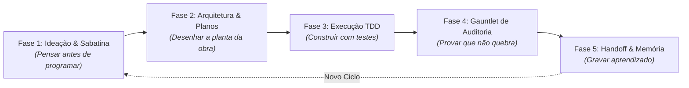

# 🚀 Guia Integrado de Desenvolvimento com IA & Skills
> **O Manual Prático de 5 Fases:** Como construir software profissional do zero à produção usando Inteligência Artificial de forma cirúrgica, sem alucinações, sem código inchado e com as 130+ skills da IDE organizadas em um passo a passo claro.

---

## 🎯 A Filosofia do Fluxo: Do Pensamento ao Código Blindado

Desenvolver com IA não é pedir para o modelo "escrever o código inteiro" de uma vez. Quando você faz isso, o modelo alucina, inventa bibliotecas e gera bugs difíceis de rastrear.

O método correto é dividido em **5 Fases Sequenciais**, onde cada fase utiliza um grupo selecionado de skills para garantir controle e qualidade total:

---

## 🧭 Fase 1: Ideação, Sabatina & Pesquisa de Mercado
> **Objetivo:** Descobrir o que realmente precisa ser feito, questionar suposições e encontrar referências reais antes de escrever uma única linha de código.

### 📋 Passo a Passo:
1. Comece expondo sua ideia ou o problema que precisa resolver.
2. Peça para a IA sabatinar a sua proposta (encontrar falhas de lógica, custos ocultos ou problemas de escala).
3. Pesquise tendências recentes e referências técnicas reais na internet.

### 🧰 Caixa de Skills Simplificada para esta Fase:
| Skill                            | O que ela faz em 1 frase                                                                            | Como pedir no chat                                                        |
| :------------------------------- | :-------------------------------------------------------------------------------------------------- | :------------------------------------------------------------------------ |
| `brainstorming`                  | Explora múltiplos caminhos criativos para resolver seu problema.                                    | *"Use `brainstorming` para sugerir 3 abordagens para este recurso."*      |
| `grill-me`                       | Vira um arquiteto exigente e te faz perguntas difíceis para achar furos na sua ideia.               | *"Ative `grill-me` e sabatine minha decisão de usar IndexedDB aqui."*     |
| `gestao-questionario-requisitos` | Monta perguntas de múltipla escolha para você decidir detalhes de escopo rapidamente.               | *"Crie um questionário estruturado com opções para definir este módulo."* |
| `firecrawl-research`             | Navega na internet, lê artigos técnicos e extrai o conteúdo limpo com fontes reais.                 | *"Pesquise com `firecrawl-research` as melhores práticas de WebSockets."* |
| `last30days`                     | Varre Reddit, X, GitHub e Hacker News para ver o que desenvolvedores reais acham de uma ferramenta. | *"O que as pessoas disseram nos últimos 30 dias sobre a biblioteca X?"*   |

---

## 📐 Fase 2: Arquitetura, Modelagem & Fatiamento em Tickets
> **Objetivo:** Criar a planta da obra. Definir nomes de variáveis do negócio, cortar complexidade inútil e fatiar a tarefa em pedaços pequenos e testáveis.

### 📋 Passo a Passo:
1. Modele o vocabulário de negócio (evite nomes técnicos genéricos; use termos do domínio).
2. Escreva o plano de implementação detalhado (`implementation_plan.md`).
3. Aplique o filtro de minimalismo **Ponytail** (corte tudo o que não for essencial).
4. Quebre o plano em tickets de trabalho ordenados (DAG de execução).

### 🧰 Caixa de Skills Simplificada para esta Fase:
| Skill                               | O que ela faz em 1 frase                                                                    | Como pedir no chat                                                                     |
| :---------------------------------- | :------------------------------------------------------------------------------------------ | :------------------------------------------------------------------------------------- |
| `writing-plans`                     | Escreve um documento formal mostrando quais arquivos serão criados, modificados e testados. | *"Escreva o plano de implementação antes de mexer no código."*                         |
| `arquitetura-modelagem-dominio`     | Alinha o código com as regras da vida real (Domain-Driven Design).                          | *"Modele as entidades deste módulo de acordo com o domínio do edital."*                |
| `arquitetura-design-modular`        | Desenha módulos que têm interfaces simples por fora e escondem a complicação por dentro.    | *"Estruture este módulo com uma interface pública coesa e desacoplada."*               |
| `ponytail`                          | Elimina abstrações excessivas e força a solução mais simples com código nativo.             | *"Ative o modo `ponytail` e simplifique esta arquitetura para o mínimo que funciona."* |
| `gestao-gerar-tickets`              | Divide uma especificação longa em tarefas pequenas (TK-01, TK-02) fáceis de programar.      | *"Fatie este plano em tickets incrementais e independentes."*                          |
| `segundo-cerebro-registrar-decisao` | Salva um registro formal de decisão técnica (ADR) no Obsidian explicando a escolha feita.   | *"Registre esta decisão arquitetural no Vault como uma nova ADR."*                     |

---

## ⚡ Fase 3: Execução Guiada por Testes (TDD) & Subagentes
> **Objetivo:** Construir o software com segurança. Primeiro cria o teste que falha, depois escreve o código real para fazê-lo passar e refatora em seguida.

### 📋 Passo a Passo:
1. Crie o teste automatizado para a nova funcionalidade (ele começará falhando no terminal: ciclo Vermelho).
2. Delegue a execução para subagentes focados em seu respectivo domínio (Backend, Frontend ou Nuvem).
3. Escreva apenas o código necessário para fazer o teste passar (ciclo Verde).
4. Limpe o código, removendo duplicações (ciclo Refatorar).

### 🧰 Caixa de Skills Simplificada para esta Fase:

#### 🧪 A. Para Testes e Confiabilidade:
- **`test-driven-development` / `ecc-tdd-workflow`:** Força a criação do teste antes da lógica real.
  - *Chamada:* *"Vamos implementar o cálculo de prazo usando TDD estrito."*
- **`systematic-debugging`:** Se algo falhar, impede chutes aleatórios e investiga a causa raiz em 4 passos.
  - *Chamada:* *"Use depuração sistemática para isolar a falha deste teste."*

#### 🖥️ B. Para Backend & Banco de Dados:
- **`subagente-backend`:** Especialista focado apenas em APIs, rotas e regras de negócio.
- **`ecc-backend-patterns`:** Boas práticas de tratamento de erros, middlewares e conexões.
- **`learned-resilient-db-timeouts`:** Garante timeouts rigorosos e fallbacks locais em consultas a bancos de dados.
- **`typescript-zod-forms`:** Cria validações blindadas de formulários e tipos que impedem dados corrompidos.
- **`managing-python-dependencies`:** Garante que bibliotecas Python fiquem isoladas no `.venv`.

#### 🎨 C. Para Frontend, Telas & Estilo:
- **`subagente-frontend`:** Especialista focado em componentes visuais e estilização.
- **`od-master-design` & `od-taste-skill`:** Impede que a tela pareça um template genérico feito por robô.
- **`od-minimalist`:** Estilo limpo, tipográfico e sem sombras artificiais exageradas.
- **`accessibility-wcag`:** Confere se o contraste de cores e navegação por teclado atendem à norma WCAG 2.1 AA.
- **`tailwind-design-system`:** Padroniza cores e temas (claro/escuro) no Tailwind CSS.

#### ☁️ D. Para Nuvem (GCP) & Big Data:
- **`bigquery-sql`:** Otimiza consultas SQL para processar bilhões de linhas gastando pouco.
- **`google-cloud-storage-basics`:** Gerencia upload, download e baldes na nuvem.
- **`dbt-bigquery` / `dataform-bigquery`:** Monta pipelines modulares de transformação de dados.
- **`gcp-pipeline-orchestration`:** Cria agendamentos de tarefas no Apache Airflow (Cloud Composer).

---

## 🛡️ Fase 4: O Gauntlet de Auditoria, Segurança & Verificação
> **Objetivo:** O tribunal de qualidade antes de comemorar. Provar com números e testes reais que o sistema funciona e não possui brechas de segurança.

### 📋 Passo a Passo:
1. Rode a esteira de verificação completa (linter, tipos, testes e integridade).
2. Execute a varredura estática de segurança contra vulnerabilidades comuns.
3. Revise o código com o olhar crítico de simplificação do Ponytail.
4. Garanta que o guardrail de Git impediu qualquer push externo acidental.

### 🧰 Caixa de Skills Simplificada para esta Fase:
| Skill | O que ela faz em 1 frase | Como pedir no chat |
| :--- | :--- | :--- |
| `verification-before-completion` | Proíbe a IA de dizer "terminei" sem rodar os comandos de teste e ler o resultado no terminal. | *"Ative `verification-before-completion` e mostre o terminal com 100% de aprovação."* |
| `ecc-verification-loop` | Roda a bateria completa de inspeção: tipos estáticos, estilo e testes. | *"Rode o loop de verificação contínuo."* |
| `ecc-security-review` | Procura senhas vazadas, brechas de injeção SQL, SSRF e vulnerabilidades de autenticação. | *"Faça uma revisão de segurança completa nos arquivos modificados."* |
| `accidental-data-loss-prevention` | Trava imediata contra comandos que possam deletar bancos de dados ou baldes inteiros. | *(Opera automaticamente em segundo plano para sua proteção)* |
| `engenharia-guardrails-git` | Bloqueia comandos perigosos do Git (como force push ou reset que apagam histórico). | *"Verifique se os guardrails do Git continuam ativos e seguros."* |
| `ponytail-review` | Revisa a alteração procurando código inútil ou bibliotecas que podem ser excluídas. | *"Faça um `ponytail-review` e me diga o que podemos deletar desse código."* |

---

## 📝 Fase 5: Handoff, Limpeza de IA & Memória no Segundo Cérebro
> **Objetivo:** Fechar o ciclo. Deixar a documentação legível para humanos, salvar os aprendizados no Vault do Obsidian e preparar o terreno para a próxima sessão.

### 📋 Passo a Passo:
1. Higienize os textos de documentação removendo vícios de escrita robótica de IA.
2. Registre as decisões arquiteturais e novos padrões aprendidos no Vault.
3. Crie um resumo de Handoff para fechar o expediente sem perder o fio da meada.

### 🧰 Caixa de Skills Simplificada para esta Fase:
| Skill | O que ela faz em 1 frase | Como pedir no chat |
| :--- | :--- | :--- |
| `stop-slop` | Remove termos robóticos e clichês de IA dos textos de documentação. | *"Passe o filtro `stop-slop` neste relatório para deixá-lo natural e direto."* |
| `segundo-cerebro-ciclo-memoria-ativa` | Salva o que foi construído e aprendido diretamente nas notas do seu cofre do Obsidian. | *"Execute o ciclo de memória ativa e atualize o painel no Obsidian."* |
| `ecc-continuous-learning` | Grava padrões novos aprendidos na sessão para a IA nunca mais cometer o mesmo erro. | *"Grave este aprendizado para as próximas sessões."* |
| `gestao-handoff-sessao` / `handoff` | Escreve um resumo compacto de onde paramos e quais são os próximos 3 passos. | *"Prepare o relatório de handoff para encerrarmos a sessão."* |
| `session-pickup` | No dia seguinte, lê o handoff anterior e retoma o trabalho instantaneamente. | *"Faça o session-pickup e continue de onde paramos ontem."* |

---

## 💡 Matriz Rápida: "O que eu quero fazer vs Qual Skill chamar"

| O que você precisa fazer agora? | Qual skill chamar no chat? |
| :--- | :--- |
| Criar uma tela bonita, moderna e que não pareça robótica | `od-master-design` + `od-minimalist` |
| Garantir que meu site funcione para deficientes visuais e via teclado | `accessibility-wcag` |
| Saber por que meu código deu erro sem a IA ficar chutando bobagens | `systematic-debugging` |
| Escrever código seguro que nunca quebra na produção | `test-driven-development` |
| Cortar código inútil e deixar o sistema leve e rápido | `ponytail` + `ponytail-review` |
| Descobrir o que a comunidade diz sobre uma tecnologia nova | `last30days` |
| Guardar uma decisão importante para o futuro do projeto | `segundo-cerebro-registrar-decisao` |
| Ter certeza de que a IA não comemorou antes de rodar os testes reais | `verification-before-completion` |
| Salvar e desligar o computador sem perder onde parei | `gestao-handoff-sessao` |

---
*Mantenha este guia sempre anexado ao seu fluxo de trabalho mental. Com ele, você comanda a IA com precisão cirúrgica e rigor profissional.*
