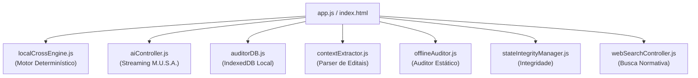

# ⚡ Frontend e LocalCrossEngine JS

> O frontend do **EditalAudit AI** foi concebido em Vanilla JavaScript de alta performance, sem o overhead de frameworks pesados, garantindo carregamento instantâneo e total autonomia de execução no navegador.

---

## 📁 Arquitetura de Controladores (`src/controllers/`)

### 1. `localCrossEngine.js` (O Coração da Auditoria Matemática)
- **Localização:** `[src/controllers/localCrossEngine.js](file:///c:/Users/victo/.gemini/antigravity-ide/scratch/edital-audit/src/controllers/localCrossEngine.js)`
- **Função:**
  - Realiza a validação cruzada entre o edital e a proposta submetida.
  - Verifica quantitativos, valores unitários, somatórios de etapas e fórmulas de planilha.
  - Audita o respeito aos tetos da Lei 14.903/2024 e Lei 14.133/2021 (ex: máximo de 15% para custos administrativos e 10% para comunicação/divulgação).
  - Execução $O(1)$ a $O(n)$ sem nenhuma latência de rede.

### 2. `aiController.js` (Orquestrador dos 14 Pareceristas M.U.S.A.)
- **Localização:** `[src/controllers/aiController.js](file:///c:/Users/victo/.gemini/antigravity-ide/scratch/edital-audit/src/controllers/aiController.js)`
- **Função:**
  - Gerencia o streaming via Server-Sent Events (SSE) com a API do Google Gemini.
  - Injeciona o contexto denso dos 14 pareceristas virtuais.
  - Renderiza badges de risco (Baixo, Médio, Crítico) em tempo real conforme os pareceres são gerados.

### 3. `auditorDB.js` (Gerenciador de Armazenamento Local)
- **Localização:** `[src/controllers/auditorDB.js](file:///c:/Users/victo/.gemini/antigravity-ide/scratch/edital-audit/src/controllers/auditorDB.js)`
- **Função:**
  - Wrapper assíncrono para o `IndexedDB` do navegador.
  - Salva propostas em rascunho, arquivos analisados, pareceres históricos e configurações de usuário.

### 4. `contextExtractor.js` (Extrator de Conteúdo de Editais)
- **Localização:** `[src/controllers/contextExtractor.js](file:///c:/Users/victo/.gemini/antigravity-ide/scratch/edital-audit/src/controllers/contextExtractor.js)`
- **Função:**
  - Faz a leitura, extração de texto e estruturação de tabelas de arquivos PDF, DOCX e planilhas XLSX anexadas.

### 5. `stateIntegrityManager.js` (Guardião de Integridade)
- **Localização:** `[src/controllers/stateIntegrityManager.js](file:///c:/Users/victo/.gemini/antigravity-ide/scratch/edital-audit/src/controllers/stateIntegrityManager.js)`
- **Função:**
  - Monitora alterações concorrentes no DOM e no IndexedDB, impedindo corrupção de dados se o usuário abrir várias abas ou fechar a janela abruptamente.

---

## 🎨 Design System e Estilos
- **Arquivo Central:** `[styles.css](file:///c:/Users/victo/.gemini/antigravity-ide/scratch/edital-audit/styles.css)`
- **Padrão:** Dark mode elegante, paleta com contraste estrito para acessibilidade (WCAG 2.1 AA), tipografia legível e animações de feedback sutis.

---

## 🔗 Links Relacionados
- [[01 - Visão e Domínio/Arquitetura Hibrida Offline-First|Arquitetura Híbrida Offline-First]]
- [[05 - Inventário Técnico e Código/Backend e Servicos Python|Backend e Serviços Python]]
- [[00 - Dashboard/00 - Painel Geral do Projeto EditalAudit|Painel Geral (MOC)]]
